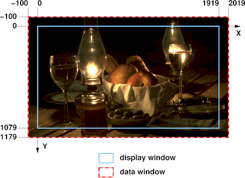

# OpenEXR

OpenEXR provides the specification and reference implementation of the
EXR file format, the professional-grade image storage format of the
motion picture industry.

The purpose of EXR format is to accurately and efficiently represent
high-dynamic-range scene-linear image data and associated metadata,
with strong support for multi-part, multi-channel use cases.

OpenEXR is widely used in host application software where accuracy is
critical, such as photorealistic rendering, texture access, image
compositing, deep compositing, and DI.

Community
=========

* **Ask for help:**

  - Email: `openexr-dev@lists.aswf.io <https://lists.aswf.io/g/openexr-dev>`_

  - Slack: `academysoftwarefdn#openexr <https://academysoftwarefdn.slack.com/archives/CMLRW4N73>`_

* **Attend a meeting:**

  - Technical Steering Committee meetings are open to the
    public, fortnightly on Thursdays, 1:30pm Pacific Time.

  - Calendar: https://lists.aswf.io/g/openexr-dev/calendar

* **Report a bug:**

  - GitHub: https://github.com/AcademySoftwareFoundation/openexr/issues

* **Make a contribution:**

  - Read the :ref:`contribution guidelines <contributing>`

  - Submit a PR: https://github.com/AcademySoftwareFoundation/openexr/pulls

* **Report a security vulnerability:**

  - Send email to security@openexr.com

Resources
=========

- Website: http://www.openexr.com
- Technical Documentation: https://openexr.readthedocs.io
- Porting help: :ref:`OpenEXR/Imath Version 2.x to 3.x Porting Guide <porting>`
- Reference images: https://github.com/AcademySoftwareFoundation/openexr-images
- Security Policy: `SECURITY.md <https://github.com/AcademySoftwareFoundation/openexr/blob/main/SECURITY.md>`_

License
=======

OpenEXR is licensed under the :ref:`BSD-3-Clause license <license>`. 

---

