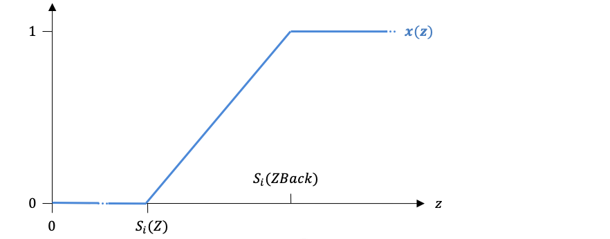
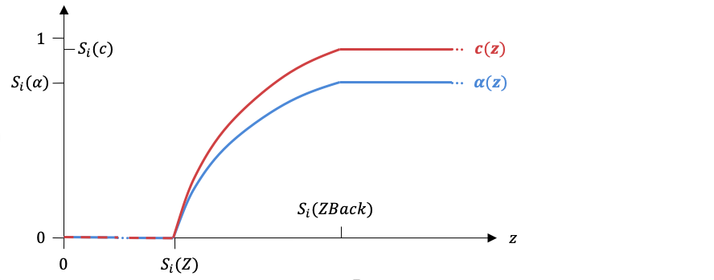

..
  SPDX-License-Identifier: BSD-3-Clause
  Copyright Contributors to the OpenEXR Project.

Interpreting OpenEXR Deep Pixels
################################

Overview 
=========

Starting with version 2.0, the OpenEXR image file format supports deep
images. In a regular, or flat image, every pixel stores at most one
value per channel. In contrast, each pixel in a deep image can store an
arbitrary number of values or samples per channel. Each of those samples
is associated with a depth, or distance from the viewer. Together with
the two-dimensional pixel raster, the samples at different depths form a
three-dimensional data set.

The open-source OpenEXR file I/O library defines the file format for
deep images, and it provides convenient methods for reading and writing
deep image files. However, the library does not define how deep images
are meant to be interpreted. In order to encourage compatibility among
application programs and image processing libraries, this document
describes a standard way to represent point and volume samples in deep
images, and it defines basic compositing operations such as merging two
deep images or converting a deep image into a flat image.

Definitions
===========

Flat and Deep Images, Samples 
------------------------------

For a single-part OpenEXR file an **image** is the set of all channels
in the file. For a multi-part file an image is the set of all channels
in the same part of the file.

A **flat image** has at most one stored value or **sample** per pixel
per channel. The most common case is an RGB image, which contains three
channels, and every pixel has exactly one :math:`R`, one :math:`G` and
one :math:`B` sample. Some channels in a flat image may be sub-sampled,
as is the case with luminance-chroma images, where the luminance channel
has a sample at every pixel, but the chroma channels have samples only
at every second pixel of every second scan line.

A **deep image** can store an unlimited number of samples per pixel, and
each of those samples is associated with a depth, or distance from the
viewer.

A pixel at pixel space location :math:`(x,y)` in a deep image has
:math:`n(x,y)` samples in each channel. The number of samples varies
from pixel to pixel, and any non-negative number of samples, including
zero, is allowed. However, all channels in a single pixel have the same
number of samples.

The samples in each channel are numbered from :math:`0` to
:math:`n(x,y) - 1`, and the expression :math:`S_{i}(c,x,y)` refers to
sample number :math:`i` in channel :math:`c` of the pixel at location
:math:`(x,y)`.

In the following we will for the most part discuss a single pixel. For
readability we will omit the coordinates of the pixel; expressions such
as :math:`n` and :math:`S_{i}(c)` are to be understood as :math:`n(x,y)`
and :math:`S_{i}(c,x,y)` respectively.

Channel Names and Layers 
-------------------------

The channels in an image have names that serve two purposes: specifying
the intended interpretation of each channel, and grouping the channels
into layers.

If a channel name contains one or more periods, then the part of the
channel name that follows the last period is the **base name**. If a
channel name contains no periods, then the entire channel name is the
base name.

Examples:

- the base name of channel ``R`` is ``R``
- the base name of channel ``L1.L2.R`` is ``R``

If a channel name contains one or more periods, then the part of the
channel name before the last period is the channel's **layer name**. If
a channel name contains no periods, then the layer name is an empty
string.

Examples:

- the layer name of channel ``R`` is the empty string
- the layer name of channel ``L1.L2.R`` is ``L1.L2``

The set of all channels in an image that share the same layer name is
called a **layer**.

The set of all channels in an image whose layer name is the empty string
is called the **base layer**.

If the name of one layer is a prefix of the name of another layer, then
the first layer **encloses** the second layer, and the second layer **is
nested in** the first layer. Since the empty string is a prefix of any
other string, the base layer encloses all other layers.

A layer **directly encloses** a second layer if there is no third layer
that is nested in the first layer and encloses the second layer.

Examples:

- Layer ``L1`` encloses layers ``L1.L2`` and ``L1.L2.L3``
- Layer ``L1`` directly encloses layer ``L1.L2``, but ``L1`` does not
  directly enclose ``L1.L2.L3``

Alpha, Color, Depth and Auxiliary Channels 
-------------------------------------------

A channel whose base name is ``A``, ``AR``,
``AG`` or ``AB`` is an **alpha channel**. All
samples must be greater than or equal to zero, and less than or equal to
one.

A channel whose base name is ``R``, ``G``, ``B``, or
``Y`` is a **color channel**.

A channel whose full name is ``Z`` or ``ZBack``, is a
**depth channel**. All samples in a depth channel must be greater than
or equal to zero.

A channel that is not an alpha, color or depth channel is an **auxiliary
channel**.

Required Depth Channels
-----------------------

The base layer of a deep image must include a depth channel that is
called ``Z``.

The base layer of a deep image may include a depth channel called
``ZBack``. If the base layer does not include one, then a
``ZBack`` channel can be generated by copying the ``Z``
channel.

Layers other than the base layer may include channels called ``Z``
or ``ZBack``, but those channels are auxiliary channels and
do not determine the positions of any samples in the image.

Sample Locations, Point and Volume Samples
------------------------------------------

The depth samples :math:`S_{i}\left( Z \right)` and :math:`S_{i}(ZBack)`
determine the positions of the front and the back of sample number
``i`` in all other channels in the same pixel.

If :math:`S_{i}\left( Z \right) \geq S_{i}\left( \text{ZBack} \right)`,
then sample number ``i`` in all other channels covers the single
depth value :math:`z = S_{i}\left( Z \right)`, where ``z`` is the
distance of the sample from the viewer. Sample number ``i`` is
called a **point sample**.

If :math:`S_{i}\left( Z \right) < S_{i}\left( \text{ZBack} \right)`,
then sample number ``i`` in all other channels covers the half open
interval
:math:`S_{i}\left( Z \right) \leq z < S_{i}\left( \text{ZBack} \right)`.
Sample number ``i`` is called a **volume sample**.
:math:`S_{i}\left( Z \right)` is the sample’s **front**
and\ :math:`\ S_{i}\left( \text{ZBack} \right)` is the sample’s
**back**.

Point samples are used to represent the intersections of surfaces with a
pixel. A surface intersects a pixel at a well-defined distance from the
viewer, but the surface has zero thickness. Volume samples are used to
represent the intersections of volumes with a pixel.

Required Alpha Channels
-----------------------

Every color or auxiliary channel in a deep image must have an
**associated alpha channel**.

The associated alpha channel for a given color or auxiliary channel,
``c``, is found by looking for a **matching** alpha channel (see
below), first in the layer that contains ``c``, then in the directly
enclosing layer, then in the layer that directly encloses that layer,
and so on, until the base layer is reached. The first matching alpha
channel found this way becomes the alpha channel that is associated with
``c``.

Each color our auxiliary channel matches an alpha channel, as shown in
the following table:

.. list-table::
   :header-rows: 1
   :align: left
                 
   * - Color or auxiliary channel base name
     - Matching alpha channel base name
   * - ``R``
     - ``AR`` if it exists, otherwise ``A``
   * - ``G``
     - ``AG`` if it exists, otherwise ``A``
   * - ``B``
     - ``AB`` if it exists, otherwise ``A``
   * - ``Y``
     - ``A``
   * - (any auxiliary channel)
     - ``A``

Example: The following table shows the list of channels in a deep
image, and the associated alpha channel for each color or auxiliary
channel.

.. list-table::
   :header-rows: 1
   :align: left
                 
   * - Channel name
     - Associated alpha channel
   * - ``A``        
     - 
   * - ``AR``
     - 
   * - ``AG``
     - 
   * - ``R``
     - ``AR``
   * - ``Z``        
     - 
   * - ``L1.A``     
     - 
   * - ``L1.AR``    
     - 
   * - ``L1.R``
     - ``L1.AR``
   * - ``L1.G``      
     - ``L1.A``
   * - ``L1.L2.G``   
     - ``L1.A``

Sorted, Non-Overlapping and Tidy Images
---------------------------------------

The samples in a pixel may or may not be sorted according to depth, and
the sample depths or depth ranges may or may not overlap each other.

A pixel in a deep image is **sorted** if for every ``i`` and
``j`` with ``i`` < ``j``,

.. math:: S_{i}\left( Z \right) < \ S_{j}\left( Z \right) \lor \left( S_{i}\left( Z \right) = S_{j}\left( Z \right) \land S_{i}\left( \text{ZBack} \right) \leq S_{j}\left( \text{ZBack} \right) \right).

A pixel in a deep image is **non-overlapping** if for every :math:`i`
and :math:`j` with :math:`i \neq j`,

.. math:: \left( S_{i}\left( Z \right) < \ S_{j}\left( Z \right) 
          \land S_{i}\left( \text{ZBack} \right) \leq \
          S_{j}\left( Z \right) \right) \lor \left( S_{j}\left( Z
          \right) < \ S_{i}\left( Z \right) \land
          S_{j}\left( \text{ZBack} \right) \leq \ S_{i}\left( Z
          \right) \right) \lor

.. math:: \left( S_{i}\left( Z \right) = \ S_{j}\left( Z
          \right) \land S_{i}\left( \text{ZBack} \right) \leq \
          S_{i}\left( Z \right) \land S_{j}\left( \text{ZBack}
          \right) > \ S_{j}\left( Z \right) \right) \lor

.. math:: \left( S_{j}\left( Z \right) = \ S_{i}\left( Z \right)
          \land S_{j}\left( \text{ZBack} \right) \leq \
          S_{j}\left( Z \right) \land S_{i}\left(
          \text{ZBack} \right) > \ S_{i}\left( Z \right) \right).

A pixel in a deep image is **tidy** if it is sorted and non-overlapping.

A deep image is sorted if all of its pixels are sorted; it is
non-overlapping if all of its pixels are non-overlapping; and it is tidy
if all of its pixels are tidy.

The images stored in an OpenEXR file are not required to be tidy. Some
deep image processing operations, for example, flattening a deep image,
require tidy input images. However, making an image tidy loses
information, and some kinds of data cannot be represented with tidy
images, for example, object identifiers or motion vectors for volume
objects that pass through each other.

Some application programs that read deep images can run more efficiently
with tidy images. For example, in a 3D renderer that uses deep images as
shadow maps, shadow lookups are faster if the samples in each pixel are
sorted and non-overlapping.

Application programs that write deep OpenEXR files can add a
**deepImageState** attribute to the header to let file readers know if the
pixels in the image are tidy or not. The attribute is of type
``DeepImageState``, and can have the following values:

=================== =====================================================
Value               Interpretation
=================== =====================================================
``MESSY``           Samples may not be sorted, and overlaps are possible.
``SORTED``          Samples are sorted, but overlaps are possible.
``NON_OVERLAPPING`` Samples do not overlap, but may not be sorted.
``TIDY``            Samples are sorted and do not overlap.
=================== =====================================================

If the header does not contain a **deepImageState** attribute, then file
readers should assume that the image is ``MESSY``. The OpenEXR file I/O
library does not verify that the samples in the pixels are consistent
with the **deepImageState** attribute. Application software that handles
deep images may assume that the attribute value is valid, as long as the
software will not crash or lock up if any pixels are inconsistent with
the **deepImageState**.

Alpha and Color as Functions of Depth
=====================================

Given a color channel, ``c``, and its associated alpha channel,
:math:`\alpha`, the samples :math:`S_{i}\left( c \right)`,
:math:`S_{i}\left( \alpha \right)`, :math:`S_{i}\left( Z \right)` and
:math:`S_{i}\left( \text{ZBack} \right)` together represent the
intersection of an object with a pixel. The color of the object is
:math:`S_{i}\left( c \right)`, its opacity is
:math:`S_{i}\left( \alpha \right)`, and the distances of its front and
back from the viewer are indicated by :math:`S_{i}\left( Z \right)` and
:math:`S_{i}\left( \text{ZBack} \right)` respectively.

One Sample
----------

We now define two functions, :math:`z \longmapsto \alpha_{i}(z)`, and
:math:`z \longmapsto c_{i}(z)`, that represent the opacity and color of
the part of the object whose distance from the viewer is no more than
``z``. In other words, we divide the object into two parts by
splitting it at distance :math:`z`; :math:`\alpha_{i}(z)` and
:math:`c_{i}(z)` are the opacity and color of the part that is closer to
the viewer.

For a point sample, :math:`\alpha_{i}(z)` and :math:`c_{i}(z)` are step
functions:

.. math:: \alpha_{i}\left( z \right) = \left\{ \begin{matrix} 0, & z < \ S_{i}(Z) \\ S_{i}\left( \alpha \right), & z \geq \ S_{i}(Z) \\ \end{matrix} \right.

.. math:: c_{i}\left( z \right) = \left\{ \begin{matrix} 0, & z < \ S_{i}(Z) \\ S_{i}\left( c \right), & z \geq \ S_{i}(Z) \\ \end{matrix} \right.

.. image:: images/InterpretingDeepPixels1.png
   :align: center           

For a volume sample, we define a helper function :math:`x(z)` that
consists of two constant segments and a linear ramp:

.. math:: x\left( z \right) = \left\{ \begin{matrix} 0, & z \leq S_{i}\left( Z \right) \\ \frac{z - S_{i}(Z)}{S_{i}\left( \text{ZBack} \right) - S_{i}(Z)}, & S_{i}\left( Z \right) < z < S_{i}(ZBack) \\ 1, & z \geq S_{i}\left( \text{ZBack} \right) \\ \end{matrix} \right.

With this helper function, :math:`\alpha_{i}(z)` and :math:`c_{i}(z)`
are defined as follows:

.. math:: \alpha_{i}\left( z \right) = 1 - \left( 1 - S_{i}\left( \alpha \right) \right)^{x(z)}

.. math:: c_{i}\left( z \right) = \left\{ \begin{matrix} S_{i}\left( c \right) \bullet \frac{\alpha_{i}\left( z \right)}{S_{i}\left( \alpha \right)}, & S_{i}\left( \alpha \right) > 0 \\ S_{i}\left( c \right) \bullet x\left( z \right), & S_{i}\left( \alpha \right) = 0 \\ \end{matrix} \right.

Note that the second case in the definition of
:math:`c_{i}\left( z \right)` is the limit of the first case as
:math:`S_{i}\left( \alpha \right)` approaches zero.

The figure below shows an example of :math:`\alpha_{i}\left( z \right)`
and :math:`c_{i}\left( z \right)` for a volume sample. Alpha and color
are zero up to :math:`Z`, increase gradually between ``Z`` and
``ZBack``, and then remain constant.

Whole Pixel
-----------

If a pixel is tidy, then we can define two functions,
:math:`z \longmapsto A(z)`, and :math:`z \longmapsto C(z)`, that
represent the total opacity and color of all objects whose distance from
the viewer is no more than :math:`z`: if the distance :math:`z` is
inside a volume object, we split the object at :math:`z`. Then we use
“over” operations to composite all objects that are no further away than
:math:`z`.

Given a foreground object with opacity :math:`\alpha_{f}` and color
:math:`c_{f}`, and a background object with opacity :math:`\alpha_{b}`
and color :math:`c_{b}`, an “over” operation computes the total opacity
and color, :math:`\alpha` and :math:`c`, that result from placing the
foreground object in front of the background object:

.. math:: \alpha = \alpha_{f} + (1 - \alpha_{f}) \bullet \alpha_{b}

.. math:: c = c_{f} + (1 - \alpha_{f}) \bullet c_{b}

We define two sets of helper functions:

.. math:: A_{i}\left( z \right) = \left\{ \begin{matrix} 0, & i < 0 \\ A_{i - 1}\left( S_{i}\left( Z \right) \right) + \left( 1 - A_{i - 1}\left( S_{i}\left( Z \right) \right) \right) \bullet \alpha_{i}\left( z \right), & i \geq 0 \\ \end{matrix} \right.

.. math:: C_{i}\left( z \right) = \left\{ \begin{matrix} 0, & i < 0 \\ C_{i - 1}\left( S_{i}\left( Z \right) \right) + \left( 1 - A_{i - 1}\left( S_{i}\left( Z \right) \right) \right) \bullet c_{i}\left( z \right), & i \geq 0 \\ \end{matrix} \right.

With these helper functions, :math:`A\left( z \right)` and :math:`C(z)`
look like this:

.. math:: A\left( z \right) = \left\{ \begin{matrix} A_{- 1}\left( z \right), & z < S_{0}(Z) \\ A_{i}\left( z \right), & S_{i}\left( Z \right) \leq z < S_{i + 1}(Z) \\ A_{n - 1}\left( z \right), & S_{n - 1}\left( Z \right) \leq z \\ \end{matrix} \right.

.. math:: C\left( z \right) = \left\{ \begin{matrix} C_{- 1}\left( z \right), & z < S_{0}(Z) \\ C_{i}\left( z \right), & S_{i}\left( Z \right) \leq z < S_{i + 1}(Z) \\ C_{n - 1}\left( z \right), & S_{n - 1}\left( Z \right) \leq z \\ \end{matrix} \right.

The figure below shows an example of :math:`A(z)` and :math:`C(z)`.
Sample number ``i`` is a volume sample; its ``ZBack`` is
greater than its :math:`Z`. Alpha and color increase gradually between
``Z`` and ``ZBack`` and then remain constant. Sample
number :math:`i + 1`, whose ``Z`` and ``ZBack`` are
equal, is a point sample where alpha and color discontinuously jump to a
new value.

Basic Deep Image Operations
===========================

Given the definitions above, we can now construct a few basic deep image
processing operations.

Splitting a Volume Sample
-------------------------

Our first operation is splitting volume sample number ``i`` of a
pixel at a given depth, :math:`z`, where:

.. math:: S_{i}\left( Z \right) < z < S_{i}\left( \text{ZBack} \right).

The operation replaces the original sample with two new samples. If the
first of those new samples is composited over the second one, then the
total opacity and color are the same as in the original sample.

For the depth channels, the new samples are:

.. math:: S_{i,new}\left( Z \right) = \ S_{i}\left( Z \right)
.. math:: S_{i + 1,new}\left( Z \right) = \ z
.. math:: S_{i,new}\left( \text{ZBack} \right) = \ z
.. math:: S_{i + 1,new}\left( \text{ZBack} \right) = \ S_{i}\left( \text{ZBack} \right)

For a color channel, ``c``, and its associated alpha channel,
:math:`\alpha`, the new samples are:

.. math:: S_{i,new}\left( \alpha \right) = \alpha_{i}(z)
.. math:: S_{i + 1,new}\left( \alpha \right) = \alpha_{i}({S_{i}\left( Z \right) + S}_{i}\left( \text{ZBack} \right) - z)
.. math:: S_{i,new}\left( c \right) = c_{i}(z)
.. math:: S_{i + 1,new}\left( c \right) = c_{i}\left( {S_{i}\left( Z \right) + S}_{i}\left( \text{ZBack} \right) - z \right)

If it is not done exactly right, splitting a sample can lead to large
rounding errors for the colors of the new samples when the opacity of
the original sample is very small. For C++ code that splits a volume
sample in a numerically stable way, see `Example: Splitting a Volume Sample`_.

Merging Overlapping Samples
---------------------------

In order to make a deep image tidy, we need a procedure for merging two
samples that perfectly overlap each other. Given two samples, ``i``
and ``j``, with

.. math:: S_{i}\left( Z \right) = \ S_{j}\left( Z \right)

and

.. math:: max\left( S_{i}\left( Z \right),S_{i}\left( \text{ZBack} \right) \right) = \ max\left( S_{j}\left( Z \right),S_{j}\left( \text{ZBack} \right) \right),

we want to replace those samples with a single new sample that has an
appropriate opacity and color.

For two overlapping volume samples, the opacity and color of the new
sample should be the same as what one would get from splitting the
original samples into a very large number of shorter sub-samples,
interleaving the sub-samples, and compositing them back together with a
series of “over” operations.

For a color channel, ``c``, and its associated alpha channel,
:math:`\alpha`, we can compute the opacity and color of the new sample
as follows:

.. math:: S_{i,new}\left( \alpha \right) = 1 - \left( {1 - S}_{i}(\alpha) \right) \bullet \left( {1 - S}_{j}(\alpha) \right)

.. math:: S_{i,new}\left( c \right) = \left\{ \begin{matrix} \frac{S_{i}\left( c \right) + S_{j}(c)}{2}, & S_{i}\left( \alpha \right) = 1 \land S_{j}\left( \alpha \right) = 1 \\ \begin{matrix} S_{i}\left( c \right), \\ S_{j}\left( c \right), \\ \end{matrix} & \begin{matrix} S_{i}\left( \alpha \right) = 1 \land S_{j}\left( \alpha \right) < 1 \\ S_{i}\left( \alpha \right) < 1 \land S_{j}\left( \alpha \right) = 1 \\ \end{matrix} \\ {\text{w\ }(S}_{i}\left( c \right) \bullet v_{i} + S_{j}(c) \bullet v_{j}) & S_{i}\left( \alpha \right) < 1 \land S_{j}\left( \alpha \right) < 1 \\ \end{matrix} \right.

where

.. math:: u_{k} = \left\{ \begin{matrix} {- log}\left( 1 - S_{k}\left( \alpha \right) \right), & S_{k}\left( \alpha \right) > 0 \\ 0, & S_{k}\left( \alpha \right) = 0 \\ \end{matrix} \right.

.. math:: v_{k} = \left\{ \begin{matrix} \frac{u_{k}}{S_{k}\left( \alpha \right)}, & S_{k}\left( \alpha \right) > 0 \\ 1, & S_{k}\left( \alpha \right) = 0 \\ \end{matrix} \right.

with :math:`k = i` or :math:`k = j`, and

.. math:: w = \left\{ \begin{matrix} \frac{S_{i,new}\left( \alpha \right)}{u_{i} + u_{j}}, & u_{i} + u_{j} \neq 0 \\ 1, & u_{i} + u_{j} = 0 \\ \end{matrix} \right.

Evaluating the expressions above directly can lead to large rounding
errors when the opacity of one or both of the input samples is very
small. For C++ code that computes\ :math:`\ S_{i,new}\left( \alpha
\right)` and :math:`S_{i,new}\left( c \right)` in a numerically robust
way, see `Example: Merging Two Overlapping Samples`_.

For details on how the expressions for :math:`S_{i,new}\left( \alpha
\right)` and :math:`S_{i,new}\left( c \right)`, can be derived, see
Peter Hillman’s paper, “The Theory of OpenEXR Deep Samples”

Note that the expressions for computing :math:`S_{i,new}\left( \alpha
\right)` and :math:`S_{i,new}\left( c \right)` do not refer to depth
at all. This allows us to reuse the same expressions for merging two
perfectly overlapping (that is, coincident) point samples.

A point sample cannot perfectly overlap a volume sample; therefore point
samples are never merged with volume samples.

Making an Image Tidy
--------------------

An image is made tidy by making each of its pixels tidy. A pixel is made
tidy in three steps:

1. Split partially overlapping samples: if there are indices :math:`i`
   and :math:`j` such sample :math:`i` is either a point or a volume
   sample, sample :math:`j` is a volume sample, and
   :math:`S_{j}\left( Z \right) < S_{i}\left( Z \right) < S_{j}(ZBack)`,
   then split sample :math:`j` at :math:`S_{i}\left( Z \right)` as shown
   on page 10 of this document. Otherwise, if there are indices
   :math:`i` and :math:`j` such that samples :math:`i` and :math:`j` are
   volume samples, and
   :math:`S_{j}\left( Z \right) < S_{i}\left( \text{ZBack} \right) < S_{j}(ZBack)`,
   then split sample :math:`j` at
   :math:`S_{i}\left( \text{ZBack} \right)`. Repeat this until there are
   no more partially overlapping samples.

2. Merge overlapping samples: if there are indices :math:`i` and
   :math:`j` such that samples :math:`i` and :math:`j` overlap
   perfectly, then merge those two samples as shown in `Merging
   Overlapping Samples`_ above. Repeat this until there are no more
   perfectly overlapping samples.

3. Sort the samples according to ``Z`` and ``ZBack`` (see
   `Sorted, Non-Overlapping and Tidy Images`_).

Note that this procedure can be made more efficient by first sorting the
samples, and then splitting and merging overlapping samples in a single
front-to-back sweep through the sample list.

Merging Two Images
------------------

Merging two deep images forms a new deep image that represents all of
the objects contained in both of the original images. Conceptually, the
deep image “merge” operation is similar to the “over” operation for flat
images, except that the “merge” operation does not distinguish between a
foreground and a background image.

Since deep images are not required to be tidy, the “merge” operation is
trivial: for each output pixel, concatenate the sample lists of the
corresponding input pixels.

Flattening an Image
-------------------

Flattening produces a flat image from a deep image by performing a
front-to-back composite of the deep image samples. The “flatten”
operation has two steps:

1. Make the deep image tidy.

2. For each pixel, composite sample ``0`` over sample ``1``.
   Composite the result over sample ``2``, and so on, until sample
   :math:`n - 1` is reached.

   Note that this is equivalent to computing
   :math:`A\left( max\left( S_{n - 1}\left( Z \right),S_{n - 1}\left( \text{ZBack} \right) \right) \right)`
   for each alpha channel and
   :math:`C\left( max\left( S_{n - 1}\left( Z \right),S_{n - 1}\left( \text{ZBack} \right) \right) \right)`
   for each color or auxiliary channel.

There is no single “correct” way to flatten the depth channels. The most
useful way to handle ``Z`` and ``ZBack`` depends on how
the flat image will be used. Possibilities include, among others:

-  Flatten the ``Z`` channel as if it was a color channel, using
   ``A`` as the associated alpha channel. For volume samples,
   replace ``Z`` with the average of ``Z`` and
   ``ZBac``\ k before flattening. Either discard the
   ``ZBack`` channel, or use the back of the last sample,
   :math:`max\left( S_{n - 1}\left( Z \right),S_{n - 1}\left( \text{ZBack} \right) \right)`,
   as the ``ZBack`` value for the flat image.

-  Treating ``A`` as the alpha channel associated with ``Z``,
   find the depth where :math:`A(z)` becomes 1.0 and store that depth in
   the ``Z`` channel of the flat image. If :math:`A(z)` never
   reaches 1.0, then store either infinity or the maximum possible
   finite value in the flat image.

-  Treating ``A`` as the alpha channel associated with ``Z``,
   copy the front of the first sample with non-zero alpha and the front
   of the first opaque sample into the ``Z`` and
   ``ZBack`` channels of the flat image.

Opaque Volume Samples
=====================

Volume samples represent regions along the :math:`z` axis of a pixel
that are filled with a medium that absorbs light and also emits light
towards the camera. The intensity of light traveling through the medium
falls off exponentially with the distance traveled. For example, if a
one unit thick layer of fog absorbs half of the light and transmits the
rest, then a two unit thick layer of the same fog absorbs three quarters
of the light and transmits only one quarter. Volume samples representing
these two layers would have alpha 0.5 and 0.75 respectively. As the
thickness of a layer increases, the layer quickly becomes nearly opaque.
A fog layer that is twenty units thick transmits less than one millionth
of the light entering it, and its alpha is 0.99999905. If alpha is
represented using 16-bit floating-point numbers, then the exact value
will be rounded to 1.0, making the corresponding volume sample
completely opaque. With 32-bit floating-point numbers, the alpha value
for a 20 unit thick layer can still be distinguished from 1.0, but for a
25 unit layer, alpha rounds to 1.0. At 55 units, alpha rounds to 1.0
even with 64-bit floating-point numbers.

Once a sample effectively becomes opaque, the true density of the
light-absorbing medium is lost. A one-unit layer of a light fog might
absorb half of the light while a one-unit layer of a dense fog might
absorb three quarters of the light, but the representation of a 60-unit
layer as a volume sample is exactly the same for the light fog, the
dense fog and a gray brick. For a sample that extends from ``Z`` to
``ZBack``, the function :math:`\alpha(z)` evaluates to 1.0
for any :math:`z > Z`. Any object within this layer would be completely
hidden, no matter how close it was to the front of the layer.

Application software that writes deep images should avoid generating
very deep volume samples. If the program is about to generate a sample
with alpha close to 1.0, then it should split the sample into multiple
sub-samples with a lower opacity before storing the data in a deep image
file. This assumes, of course, that the software has an internal volume
sample representation that can distinguish very nearly opaque samples
from completely opaque ones, so that splitting will produce sub-samples
with alpha significantly below 1.0.

Appendix: C++ Code
==================

.. _splitting a volume sample appendix:

Example: Splitting a Volume Sample
----------------------------------

.. literalinclude:: src/splitVolumeSample.cpp
   :linenos:
      
Example: Merging Two Overlapping Samples
----------------------------------------

.. literalinclude:: src/mergeOverlappingSamples.cpp
   :linenos:

      
