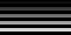

..
  SPDX-License-Identifier: BSD-3-Clause
  Copyright Contributors to the OpenEXR Project.

.. _Hello:

Hello, World
############

.. toctree::
   :caption: Hello, World
   :maxdepth: 1

Write an Image
==============

This example :download:`exrwriter.cpp <src/exrwriter/exrwriter.cpp>`
program writes a simple image ``stripes.exr``:

.. literalinclude:: src/exrwriter/exrwriter.cpp

This creates an image 100 pixels wide and 50 pixels high with
horizontal stripes 5 pixels high of graduated intensity, bright on the
bottom of the image and dark towards the top. Note that ``pixel[0][0]``
is in the upper left:

The :download:`CMakeLists.txt <src/exrwriter/CMakeLists.txt>` file to
build is:
   
.. literalinclude:: src/exrwriter/CMakeLists.txt

To build:

.. literalinclude:: src/exrwriter/build.sh

For more details, see :ref:`The OpenEXR API`.

Read an Image
=============

This companion example :download:`exrreader.cpp <src/exrreader/exrreader.cpp>`
program reads the ``stripes.exr`` file written by the writer program above:

.. literalinclude:: src/exrreader/exrreader.cpp

And the :download:`CMakeLists.txt <src/exrreader/CMakeLists.txt>` file to build:
   
.. literalinclude:: src/exrreader/CMakeLists.txt

To build:

.. literalinclude:: src/exrreader/build.sh

              
