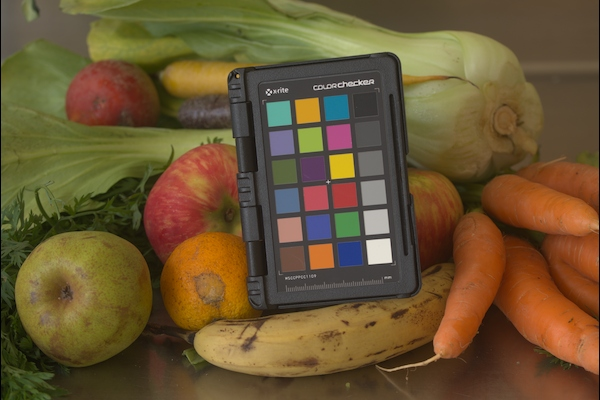
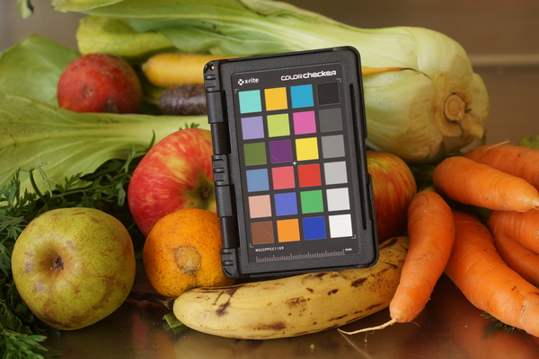
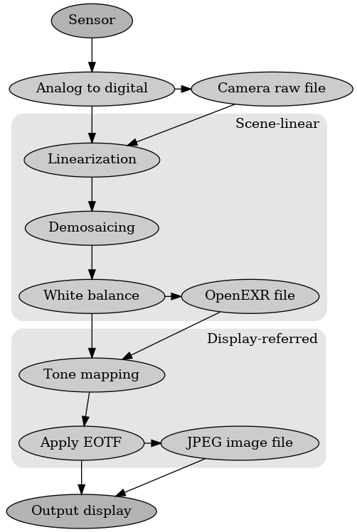

.. SPDX-License-Identifier: BSD-3-Clause
   Copyright Contributors to the OpenEXR Project.

More about Scene-linear images
##############################

OpenEXR images are intended to store scene referred (or input referred) linear
data. "Input referred" means the pixel values indicate how much light was
received by the camera. Most images are output-referred, where the values
indicate how much light should be used to display the image on a screen (or how
much ink to use to print the image onto paper), and do not store linear data.

This is a brief description of why these are not the same, what linear-light
means, and why using scene-referred images may be beneficial. For simplicity, we
will assume the image is either photographed by a digital camera, or generated
by software which is intended to produce images which appear to be digital
photographs (*photorealistic* images), and that the image is displayed on a
computer monitor.

Note that although OpenEXR images were designed to store scene-referred color,
this is not enforced by the library so OpenEXR images are not guaranteed to be
scene-referred or to store linear-light values. There may be practical reasons
store image data in an OpenEXR image encoded with a different convention. When
sharing OpenEXR images with others, it is important to clarify exactly how the
data is represented in the file. This also means the default processing applied
by a software package to an OpenEXR image may not be consistent with the way the
data is stored.

Input vs Output: Tone mapping and creativity
============================================

Few monitors are capable of representing the real world accurately. Monitors are
limited in their brightness and many don't display very dark colors (they have a
limited *contrast ratio*). Also, they cannot produce colors as vivid as those
seen in the real world. A scene in a forest may have clouds which are 25,000
times brighter than the darkest shadows in the trees. A camera may be able to
capture that contrast ratio, but monitors may only display a range of about
1000:1. To ensure that the image on the monitor shows detail in the clouds as
well as the shadows, the contrast range of the image is reduced, lifting the
brightness of the shadows and darkening down the clouds. Similarly the
colorfulness is reduced to fit within the range of colors that typical displays
have. Reducing the range of the image is often called
`Tone Mapping <https://en.wikipedia.org/wiki/Tone_mapping>`_ and reducing the
colorfulness is often called
`Gamut Compression <https://docs.acescentral.com/guides/rgc-user/>`_
[#ftonemap]_

This is not a new idea: film stock does exactly the same thing chemically. This
is because film projectors also have limited dynamic range. The film process is
designed to project (or print onto paper) an image of lower contrast than the
lens captured, so that it can represent details in both bright and dark areas
without needing as much contrast as the original scene. With film, the contrast
usually is very low in bright parts of the scene, slightly higher than the
original in the middle range, and higher in the dark shadows. This allows detail
in clouds, and a feeling of darkness in shadows. This also affects the colors,
tending to reduce the colorfulness of bright areas, and increasing the
colorfulness of dark ones.

   Example of image displayed with no tone mapping: although most colors are displayed faithfully
   to the original, the image looks flat

   The same image displayed with the camera's default tone mapping to create
   a more pleasing image with darker shadows and more vivid colors

Such film-based images are so common that an image which has not had that
process applied appears incorrect, so many tone mapping approaches are inspired
by reproducing what film would do, to make the image appear more familiar and so
more natural. The images above illustrate this. The first version of the image
presents the pixels with the same color and intensity that the real objects had
[#fsrgb]_. This particular scene has low enough contrast and subtle enough colors
that monitors are capable of displaying it faithfully. The second image is a
JPEG created by the camera using its built-in tone mapping of the image. This
image looks more pleasing, even though the colors are no longer faithful to
those originally observed.

High Dynamic Range displays don't need as much tone mapping, since their dynamic
range can be much closer to the original image, and LED and laser-based
technology can display images which appear to be almost as colorful as the real
world, but the audience is so used to seeing film-like images with contrast
adjustments applied that it is usual to apply a certain amount of tone
mapping.
`Appendix 1 of BT.2100 <https://www.itu.int/dms_pubrec/itu-r/rec/bt/R-REC-BT.2100-2-201807-I!!PDF-E.pdf>`_
discusses tone mapping in HDR images.

Images may also have a creative look applied. An artist may want the
image to be represented differently, perhaps dramatically darkening the clouds
or lifting the brightness of the entire image so that the dark areas are light
gray instead of black. They may remove the color completely and make the image
black and white. This could be done manually with an image editing tool, or by
choosing a predefined transform to modify the image.

Most digital images already have such mapping applied: the tone mapping has been
applied ready for display. JPEG (or HEIF) images taken by digital cameras and
mobile phones have already been processed ready for display. This means the
image is *output referred*: the numbers in the image represent how it should be
displayed on a screen. By contrast, the OpenEXR format is designed to store
*input referred* values, where the numbers represent the light captured by the
camera. Input-referred images have not (yet) been tone mapped ready for display.

Advantages of scene-referred representation
===========================================

Since scene referred images represent what the camera saw, they are ideal for
applying photo-real modifications. Scene referred imagery can help when
inserting a computer generated character into a photographed background, and
make it appear as if the character was really there. We wish to make the
combined image appear as if a camera really photographed it, so we need to
compute what light would have been captured by the camera. This task is much
easier if the photographed background is a scene referred image, and the
software that generates the character also stores a scene referred image as seen
by the 'virtual camera' in the software. If both the photograph of the
background and the computer generated image are output referred, with some
artistic look applied, it will be much harder to produce a convincing composite
image. OpenEXR images are widely used for motion picture visual effects
precisely for this reason, and are increasingly used in photoreal computer
games.

Scene-referred images are also helpful precisely because they have not yet been
tone mapped. A processing task such as removing unwanted objects can be done
using scene-referred images, because the object will need to be removed
regardless of what further processing is applied. Decisions about artistic looks
can be applied to the scene-referred images after the object is removed.
Multiple tone-mappings can also be applied to the data to suit different display
environments without the need to redo any work.

Disadvantages of Scene-referred representation
==============================================

Many of the advantages of using OpenEXR images and working with scene referred
can also be disadvantages: because the file stores more detail than other
formats, it is larger on disk and slower to process than other formats. Also,
because it is input referred, further processing is required before display to
tone map the image. That takes extra compute overhead, and there is a potential
confusion if different people are looking at the same image but processing it
for display in different ways.

For certain tasks, such as editing or titling video, there may not be an
advantage in using scene-referred images, and formats other than OpenEXR may be
more appropriate.

Non-linear representation and High Dynamic Range
================================================

OpenEXR images are also intended to be *linear-light*: the numbers in the image
are directly proportional to the amount of light they represent. So, a pixel
which stores a value of 1000 represents one thousand times more light than a
pixel with a value 1. This makes computation much faster and more accurate.
Generally, output-referred images do not store linear values. The eye is less
sensitive to small changes in bright objects than to changes in dark ones. A
change in image intensity between 0.1 and 0.2
`nits <https://en.wikipedia.org/wiki/Candela_per_square_metre>`_
on a display is far more apparent than a change between 75 and 80 nits even
though it's 50 times smaller. Display encoded images therefore concentrate
accuracy in low values, sacrificing accuracy in high detail. This allows for
images to be stored with less precision, but appear just as accurate, as a
larger image stored in linear. This non-linearity is often called an
Electro-Optical Transform Function (EOTF), since it maps between the values stored
electronically in the file and those presented optically on the monitor [#feotf]_.

To handle an image with an EOTF, it is important to understand what that
function is. It is often necessary to undo the function before modifying values,
then reapply the function, which causes of a loss of precision.  OpenEXR images
using floating point linear values to represent pixel intensities. Floating
point values also store small values with more absolute precision than large
ones, but there is no need to undo a function before using the values.

Output referred images are often scaled relative to a maximum value, used to
represent 100% brightness on the display device. For 8 bit images, this is
usually 255. Because OpenEXR images are input referred, and represent the amount
of incoming light, there should be no such limit: the light could always have
been a little brighter.

The convention for scene-referred linear-light images is that the number
represents how much light the surface reflects. A flat surface that reflects 90%
of the light should be stored with a value of 0.90. Many tests cards are 18%
gray, so should be represented by 0.18 [#fscenelinear]_. Typically, bright
reflections on metal would read around 10.0, and bright lights above 100.0.

In practice, OpenEXR does have a maximum value it can store (65504 in Half Float
mode, 340282346638528859811704183484516925440 in Full float mode), but these
values are rarely reached, because those values correspond to extremely bright
lights. This means it is possible to double the brightness of an image, save and
reload it, then make it darker again, without loosing detail due to values being
clipped.

Image Processing flowgraph
==========================

This diagram is a simplified overview of an image processing chain between a
digital camera and a display. OpenEXR images are input referred and have had
camera-specific processing applied to bring them to a normalized scene referred
linear space. JPEG images are output referred, and have had all steps applied,
ready to display. Other images which are created through the color chain need
subsequent steps applied before being displayed.

Color management resources
==========================

`OpenColorIO <https://opencolorio.org/>`_ (OCIO) is a framework providing
software libraries to apply color transformations based on a configuration.
Since the same config is shared by all OCIO-compatible software, color
conversions can be applied consistently when working with the same images in
multiple software packages.

The `Academy Color Encoding System (ACES) <https://acescentral.com/>`_ defines
standard workflows to convert from raw camera images to scene-linear images, and
a standard tone mapping system for convert to output referred images.
OpenColorIO configs are available which implement the necessary conversions.
ACES image files (specified by SMPTE ST2065-4) are scene-linear OpenEXR
images.

`OpenImageIO <https://github.com/AcademySoftwareFoundation/OpenImageIO>`_
provides a library and command line tools for loading and saving images in
multiple formats, including OpenEXR, and supports image processing with
OpenColorIO.

.. rubric:: Footnotes

.. [#ftonemap] Other terms are used for tone mapping and gamut compression,
   such as applying a Rendering Transform, Look, display LUT, Filter, or OOTF
   (Opto-Optical Transfer function); many approaches combine both color and
   contrast modification into a single step. Here, the term 'tone mapping' is used.

.. [#fsrgb] The colors in the first image will be rendered as observed on
   monitors which are calibrated for sRGB with a maximum intensity of
   62 cd/m :superscript:`2`. Most monitors will display the colors accurately
   but slightly too bright.

.. [#feotf] Other terms for EOTF include applying a gamma or log function,
   or simply a 'monitor curve'.

.. [#fscenelinear] One convention is to use the term *input-referred linear* for any
   image where the values are proportional to how much light the camera captured,
   and *scene-linear* for an input-referred linear image where the values are scaled
   such that a correctly exposed 18% grey card has a value of 0.18.
   Others use the two terms interchangeably.
