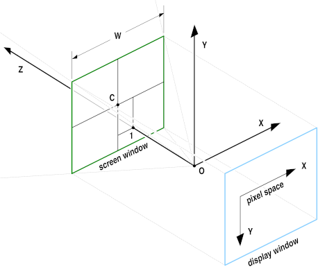
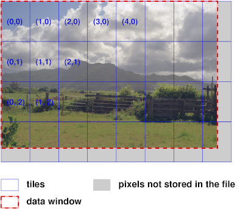

..
  SPDX-License-Identifier: BSD-3-Clause
  Copyright Contributors to the OpenEXR Project.

.. _Technical Introduction to OpenEXR:

Technical Introduction to OpenEXR
#################################

.. toctree::
   :caption: Technical Introduction

Features of OpenEXR
===================

A unique combination of features makes OpenEXR a good fit for
high-quality image processing and storage applications:

**high dynamic range**
  Pixel data are stored as 16-bit or 32-bit floating-point
  numbers. With 16 bits, the representable dynamic range is
  significantly higher than the range of most image capture devices:
  109 or 30 f-stops without loss of precision, and an additional 10
  f-stops at the low end with some loss of precision. Most 8-bit file
  formats have around 7 to 10 stops.

**good color resolution**
  With 16-bit floating-point numbers, color resolution is 1024 steps
  per f-stop, as opposed to somewhere around 20 to 70 steps per f-stop
  for most 8-bit file formats. Even after significant processing (for
  example, extensive color correction) images tend to show no
  noticeable color banding.

**compatible with graphics hardware**
  The 16-bit floating-point data format is fully compatible with the
  16-bit frame-buffer data format used in some new graphics
  hardware. Images can be transferred back and forth between an
  OpenEXR file and a 16-bit floating-point frame buffer without losing
  data.
                                                      
  Most of the data compression methods currently implemented in
  OpenEXR are lossless; repeatedly compressing and uncompressing an
  image does not change the image data. With the lossless compression
  methods, photographic images with significant amounts of film grain
  tend to shrink to somewhere between 35 and 55 percent of their
  uncompressed size. OpenEXR also supports lossy compression, which
  tends to shrink image files more than lossless compression, but
  doesn't preserve the image data exactly. New lossless and lossy
  compression schemes can be added in the future.

**arbitrary image channels**
  OpenEXR images can contain an arbitrary number and combination of
  image channels, for example red, green, blue, and alpha; luminance
  and sub-sampled chroma channels; depth, surface normal directions,
  or motion vectors.

**scan line and tiled images, multi-resolution images**
  Pixels in an OpenEXR file can be stored either as scan lines or as
  tiles. Tiled image files allow random-access to rectangular
  sub-regions of an image. Multiple versions of a tiled image, each
  with a different resolution, can be stored in a single
  multi-resolution OpenEXR file.
                                                      
  Multi-resolution images, often called "mipmaps" or "ripmaps", are
  commonly used as texture maps in 3D rendering programs to accelerate
  filtering during texture lookup, or for operations like stereo image
  matching. Tiled multiresultion images are also useful for
  implementing fast zooming and panning in programs that interactively
  display very large images.

**ability to store additional data**
  Often it is necessary to annotate images with additional data; for
  example, color timing information, process tracking data, or camera
  position and view direction. OpenEXR allows storing of an arbitrary
  number of extra attributes, of arbitrary type, in an image
  file. Software that reads OpenEXR files ignores attributes it does
  not understand.

**easy-to-use C++ and C programming interfaces**
  In order to make writing and reading OpenEXR files easy, the file
  format was designed together with a C++ programming interface. Two
  levels of access to image files are provided: a fully general
  interface for writing and reading files with arbitrary sets of image
  channels, and a specialized interface for the most common case (red,
  green, blue, and alpha channels, or some subset of
  those). Additionally, a C-callable version of the programming
  interface supports reading and writing OpenEXR files from programs
  written in C.
                                                      
  Many application programs expect image files to be scan line
  based. With the OpenEXR programming interface, applications that
  cannot handle tiled images can treat all OpenEXR files as if they
  were scan line based; the interface automatically converts tiles to
  scan lines.
                                                      
  The C++ and C interfaces are implemented in the open-source OpenEXR
  library.

**fast multi-threaded file reading and writing**
  The OpenEXR library supports multi-threaded reading or writing of an
  OpenEXR image file: while one thread performs low-level file input
  or output, multiple other threads simultaneously encode or decode
  individual pieces of the file.

**portability**
  The OpenEXR file format is hardware and operating system
  independent. While implementing the C and C++ programming
  interfaces, an effort was made to use only language features and
  library functions that comply with the C and C++ ISO standards.

**multi-view**
  A “multi-view” image shows the same scene from multiple different
  points of view. A common application is 3D stereo imagery, where a
  left-eye and a right-eye view of a scene are stored in a single
  file.
                                                   
**deep data**
  Support for a new data type has been added: deep data. Deep images
  store an arbitrarily long list of data at each pixel location. This
  is different from multichannel or 'deep channel images' which can
  store a potentially large, but fixed, amount of information at each
  pixel. In a deep image, each pixel stores a different amount of
  data.
          
  This allows for more accurate compositing of objects which occlude
  each other, and provides a method for storing opacity data in the z
  direction (particularly useful for stereo images which have
  atmospheric effects such fog).

**multi-part**
  Multi-part files allow for storing multiple images in one OpenEXR
  file. One important application is to store layers of channels
  separately. This allows for faster access when only a subset of the
  channels needs reading. It also permits layers to have differing
  data layout (for example, for different compression, or different
  layout) and different data windows.
          
  It also allows some layers to be stored as deep data and others as
  regular images. With multi-part files, different views are stored in
  different parts.

Overview of the OpenEXR File Format
===================================

Definitions and Terminology
---------------------------

Pixel space
~~~~~~~~~~~

*Pixel space* is a 2D coordinate system with x increasing from left to
right and y increasing from top to bottom. *Pixels* are data samples,
taken at integer coordinate locations in pixel space.

Display window
~~~~~~~~~~~~~~

The boundaries of an OpenEXR image are given as an axis-parallel
rectangular region in pixel space, the *display window*. The display
window is defined by the positions of the pixels in the upper left and
lower right corners, (x :sub:`min`, y :sub:`min`) and
(x :sub:`max`, y :sub:`max`).

Data window
~~~~~~~~~~~

An OpenEXR file may not have pixel data for all the pixels in the
display window, or the file may have pixel data beyond the boundaries of
the display window. The region for which pixel data are available is
defined by a second axis-parallel rectangle in pixel space, the *data
window*.

Examples:

1. Assume that we are producing a movie with a resolution of 1920 by
   1080 pixels. The display window for all frames of the movie is (0, 0)
   - (1919, 1079). For most images, in particular finished frames that
   will be recorded on film, the data window is the same as the
   display window, but for some images that are used in producing the
   finished frames, the data window differs from the display window.

2. For a background plate that will be heavily post-processed, extra
   pixels, beyond the edge of the film frame, are recorded and the
   data window is set to (-100, -100) - (2019, 1179). The extra pixels
   are not normally displayed. Their existence allows operations such
   as large-kernel blurs or simulated camera shake to avoid edge
   artifacts.

.. image:: images/windowExample1.png 
   :align: center

3. While tweaking a computer-generated element, an artist repeatedly
   renders the same frame. To save time, the artist renders only a
   small region of interest close to the center of the image. The data
   window of the image is set to (1000, 400) - (1400, 800). When the
   image is displayed, the display program fills the area outside of
   the data window with some default color.

.. image:: images/windowExample2.png
   :align: center
           
Image channels and sampling rates
~~~~~~~~~~~~~~~~~~~~~~~~~~~~~~~~~

Every OpenEXR image contains one or more *image channels*. Each
channel has a name, a data type, and x and y *sampling rates*.

The channel's name is a text string, for example ``R``, ``Z`` or
``yVelocity``. The name tells programs that read the image file how to
interpret the data in the channel.

For a few channel names, interpretation of the data is predefined:

.. list-table::
   :header-rows: 1
   :align: left
      
   * - name
     - interpretation
   * - R
     - red intensity
   * - G
     - green intensity
   * - B
     - blue intensity
   * - A
     - alpha/opacity: 0.0 means the pixel is transparent; 1.0 means
       the pixel is opaque. By convention, all color channels are
       premultiplied by alpha, so that ``foreground + (1-alpha) x
       background`` performs a correct "over" operation. (See
       `Premultiplied vs. Un-Premultiplied Color Channels`_)

Three channel data types are currently supported:

.. list-table::
   :header-rows: 1
   :align: left
      
   * - type name
     - description
   * - ``HALF``
     - 16-bit floating-point numbers; for regular image data. (See
       `The half Data Type`_.
   * - ``FLOAT``
     - 32-bit IEEE-754 floating-point numbers; used where the range or
       precision of 16-bit number is not sufficient (for example,
       depth channels).

   * - ``UINT``
     - 32-bit unsigned integers; for discrete per-pixel data such as
       object identifiers.

The channel's x and y sampling rates, s :sub:`x` and s :sub:`y`,
determine for which of the pixels in the image's data window data are
stored in the file. Data for a pixel at pixel space coordinates (x, y)
are stored only if

.. math::    x \mod{s_x} = 0

and

.. math::    y \mod{s_y} = 0

For RGBA (red, green, blue, alpha) images, s\ :sub:`x` and s\ :sub:`y`
are 1 for all channels, and each channel contains data for every
pixel.  For other types of images, some channels may be
sub-sampled. For example, in images with one luminance channel, Y, and
two croma channels, RY and BY, s\ :sub:`x` and s\ :sub:`y` would be 1
for the Y channel, but for the RY and BY channels, s\ :sub:`x` and s\
:sub:`y` might be set to 2, indicating that chroma data are only given
for one out of every four pixels. (See also `Luminance/Chroma
Images`_).

      
Projection, camera coordinate system and screen window
~~~~~~~~~~~~~~~~~~~~~~~~~~~~~~~~~~~~~~~~~~~~~~~~~~~~~~

Many images are generated by a perspective *projection*. We assume
that a camera is located at the origin, O, of a 3D *camera coordinate
system*. The camera looks along the positive z axis. The positive x
and y axes correspond to the camera's ``left`` and ``up`` directions. The
3D scene is projected onto the z = 1 plane. The image recorded by the
camera is bounded by a rectangle, the *screen window*. In pixel space,
the screen window corresponds to the file's display window. In the
file, the size and position of the screen window are specified by the
x and y coordinates of the window's center, C, and by the window's
width, W. The screen window's height can be derived from C, W, the
display window and the pixel aspect ratio.

Scan lines
~~~~~~~~~~

In scan line based files, the image's pixels are stored in horizontal
rows, or *scan lines*. A file whose data window is (x\ :sub:`min`, y\
:sub:`min`) - (x\ :sub:`max`, y\ :sub:`max`) contains y\ :sub:`max` -
y\ :sub:`min` + 1 scan lines. Each scan line contains x\ :sub:`max` -
x\ :sub:`min` + 1 pixels.

Scan line based files cannot contain multi-resolution images.

Tiles
~~~~~

In tiled files, the image is subdivided into an array of smaller
rectangles, called *tiles*. Each tile contains p\ :sub:`x` by p\
:sub:`y` pixels. An image whose data window is (x\ :sub:`min`, y\
:sub:`min`) - (x\ :sub:`max`, y\ :sub:`max`) contains ceil(w/p\
:sub:`x`) by ceil(h/p\ :sub:`y`) tiles, where w and h are the width
and height of the data window:

.. math::    w = x_max - x_min + 1

.. math::    h = y_max - y_min + 1

The upper left corner of the upper left tile is aligned with the upper
left corner of the data window, at (x\ :sub:`min`, y\ :sub:`min`). The
rightmost column and the bottom row of tiles may extend outside the
data window. If a tile contains pixels that are outside the data
window, then those extra pixels are discarded when the tile is stored
in the file.

           
Levels and level modes
~~~~~~~~~~~~~~~~~~~~~~

A single tiled OpenEXR files may contain multiple versions of the same
image, each with a different resolution. Each version is called a
*level*. The number of levels in a file and their resolutions depend
on the file's *level mode*. Currently, OpenEXR supports three level
modes:

+-------------------+-------------------------------------------------------------------+
|     mode name     | description                                                       |
+-------------------+-------------------------------------------------------------------+
| ``ONE_LEVEL``     | The file contains only a single full-resolution level. A tiled    |
|                   | ``ONE_LEVEL`` file is equivalent to a scan line based file; the   |
|                   | only difference is that pixels are accessed by tile rather than   |
|                   | by scan line.                                                     |
+-------------------+-------------------------------------------------------------------+
| ``MIPMAP_LEVELS`` | The file contains multiple versions of the image. Each            |
|                   | successive level is half the resolution of the previous level     |
|                   | in both dimensions. The lowest-resolution level contains only a   |
|                   | single pixel. For example, if the first level, with full          |
|                   | resolution, contains 16×8 pixels, then the file contains four     |
|                   | more levels with 8×4, 4×2, 2×1, and 1×1 pixels respectively.      |
+-------------------+-------------------------------------------------------------------+
| ``RIPMAP_LEVELS`` | Like ``MIPMAP_LEVELS``, but with more levels. The levels include  |
|                   | all combinations of reducing the resolution of the first level    |
|                   | by powers of two independently in both dimensions. For example,   |
|                   | if the first level contains 4×4 pixels, then the file contains    |
|                   | eight more levels, with the following resolutions:                |
|                   |                                                                   |
|                   | +-----+-----+-----+                                               |
|                   | |     | 2x4 | 1x4 |                                               |
|                   | +-----+-----+-----+                                               |
|                   | | 4x2 | 2x2 | 1x2 |                                               |
|                   | +-----+-----+-----+                                               |
|                   | | 4x1 | 2x1 | 1x1 |                                               |
|                   | +-----+-----+-----+                                               |
+-------------------+-------------------------------------------------------------------+
       
Level numbers, level size and rounding mode
~~~~~~~~~~~~~~~~~~~~~~~~~~~~~~~~~~~~~~~~~~~

Levels are identified by *level numbers*. A level number is a pair of
integers, (l\ :sub:`x`, l\ :sub:`y`). Level ``(0,0)`` is the
highest-resolution level, with ``w`` by ``h`` pixels. Level (l\
:sub:`x`, l\ :sub:`y`) contains

.. math:: \text{rf} \left( w / 2^{l_x} \right)

by

.. math:: \text{rf} \left( h / 2^{l_y} \right)

pixels, where rf(x) is a rounding function, either floor(x) or
ceil(x), depending on the file's *level size rounding mode*
(``ROUND_DOWN`` or ``ROUND_UP``).

``MIPMAP_LEVELS`` files contain only levels where l\ :sub:`x` = l\
:sub:`y`.  ``ONE_LEVEL`` files contain only level ``(0,0)``.

Examples:

1. The levels in a ``RIPMAP_LEVELS`` file whose highest-resolution
level contains 4 by 4 pixels have the following level numbers:

+------------+-------+-------------------------+
|            |       | .. centered:: **width** |
+------------+-------+-------+-------+---------+
|            |       | **4** | **2** | **1**   |
+------------+-------+-------+-------+---------+
|            | **4** | (0,0) | (1,0) | (2,0)   |
+------------+-------+-------+-------+---------+
| **height** | **2** | (0,1) | (1,1) | (2,1)   |
+------------+-------+-------+-------+---------+
|            | **1** | (0,2) | (1,2) | (2,2)   |
+------------+-------+-------+-------+---------+

In an equivalent ``MIPMAP_LEVELS`` file, only levels (0,0), (1,1), and (2,2)
are present.

2. In a MIPMAP_LEVELS file with a highest-resolution level of 15 by 17
pixels, the resolutions of the remaining levels depend on the level
size rounding mode:

.. list-table::
   :header-rows: 1
   :align: left

   * - rounding mode
     - level resolution
   * - ``ROUND_DOWN``
     - 15×17, 7×8, 3×4, 1×2, 1×1
   * - ``ROUND_UP``
     - 15×17, 8×9, 4×5, 2×3, 1×2, 1×1

Tile coordinates
~~~~~~~~~~~~~~~~

In a file with multiple levels, tiles have the same size, regardless
of their level. Lower-resolution levels contain fewer, rather than
smaller, tiles. Within a level, a tile is identified by a pair of
integer *tile coordinates*, which specify the tile's column and
row. The upper left tile has coordinates (0,0). In order to identify a
tile uniquely in a multi-resolution file, both the tile coordinates
and the level number are needed.

View
~~~~

A *view* is a set of image channels, identified by naming convention
and the view header attribute. This is usually used to store stereo
files, with one view for each eye. Views can be stored in separate
files, or together in a single file.

Part
~~~~

A *part* is made up of a header and an associated offset table and
pixels. In a single-part file, there is one header, one offset table,
and corresponding pixel data. In a multi-part file, there can be two
or more parts - with each part having one header, one offset table and
corresponding pixel data.

**Note:** This is different from a multi-view file, though you can
store views as separate parts if you wish.

Deep Data
~~~~~~~~~

OpenEXR 2.0 supports *deep data*. Deep data images store an
arbitrarily long list of data at each pixel location. This is
different from multichannel or 'deep channel images' which can store a
potentially large, but fixed, amount of information at each pixel. In
a deep image, each pixel stores a different amount of data.

Deep data can be deep scaline data or deep tile data, the type is
defined in the header attributes for that part. Deep data is supported
in single-part and multi-part files. In single-part files, it forms
the deep scan line block or deep tile component. In multi-part files
it can be stored in any chunk regardless of the data type stored in
other chunks.

Each pixel contains a list of *samples*. Each sample contains a
**fixed** number of *channels*. Typically, the data is used to store
deep z-buffer information, where each sample represents the colour at
a different depth.

Some users choose to use a different file extension to indicate that
an OpenEXR contains deep data (for example, to allow an appropriate
viewer to load when double-clicking a file). In such circumstances,
the extension DXR ("DepthEXR") is recommended. However, since v2.0
files can contain a mixture of flat and deep data this practice should
be discouraged in favour of the EXR extension.

File Structure
--------------

An OpenEXR file is made up of: the *header* and the *pixels*.

Header
~~~~~~

The header is a list of *attributes* that describe the pixels. An
attribute is a named data item of an arbitrary type. To ensure that
OpenEXR files written by one program can be read by other programs,
certain required attributes must be present in all OpenEXR file
headers:

.. list-table::
   :header-rows: 1
   :align: left
   
   * - attribute name
     - description
   * - ``displayWindow`` ``dataWindow``
     - The image's display and data window.
   * - ``pixelAspectRatio``
     - Width divided by height of a pixel when the image is displayed
       with the correct aspect ratio. A pixel's width (height) is the
       distance between the centers of two horizontally (vertically)
       adjacent pixels on the display. 
   * - ``channels``
     - Description of the image channels stored in the file. 
   * - ``compression``
     - Specifies the compression method applied to the pixel data of
       all channels in the file. 
   * - ``lineOrder``
     - Specifies in what order the scan lines in the file are stored
       in the file (increasing Y, decreasing Y, or, for tiled images,
       also random Y). 
   * - ``screenWindowWidth`` ``screenWindowCenter``
     - Describe the perspective projection that produced the image.
       Programs that deal with images as purely two-dimensional
       objects may not be able so generate a description of a
       perspective projection. Those programs should set
       screenWindowWidth to 1, and screenWindowCenter to (0, 0).
   * - ``tiles``
     - This attribute is required only for tiled files. It specifies
       the size of the tiles, and the file's level mode. 

In addition to the required attributes, a program may place any number
of additional attributes in the file's header. Often it is necessary
to annotate images with additional data, for example color timing
information, process tracking data, or camera position and view
direction. Those data can be packaged as extra attributes in the image
file's header.

Multi-View Header Attributes
^^^^^^^^^^^^^^^^^^^^^^^^^^^^

This attribute is required in the header for multi-view OpenEXR files.

.. list-table::
   :header-rows: 1
   :align: left
   
   * - attribute name
     - notes
   * - ``view``
     - Specifies the view this part is associated with (mostly used
       for files which stereo views). 
       * A value of ``left`` indicate the part is associated with the left eye.
       * A value of ``right`` indicates the right eye
       If there is no ``view`` attribute in the header, the entire part
       contains information not dependent on a particular eye. 

For more information about multi-view files, see
:doc:`MultiViewOpenEXR`.

Multi-part and Deep Data Attributes
^^^^^^^^^^^^^^^^^^^^^^^^^^^^^^^^^^^

These attributes are required in the header for all multi-part and/or
deep data OpenEXR files.

.. list-table::
   :header-rows: 1
   :align: left
   
   * - attribute name
     - notes
   * - ``name``
     - The name attribute defines the name of each part. The name of
       each part must be unique. Names may contain '*.*' characters to
       present a tree-like structure of the parts in a file. 
   * - ``type``
     - Data types are defined by the type attribute. There are four
       types:

       1. Scan line images: indicated by a type attribute of ``scanlineimage``. 
       2. Tiled images:  indicated by a type attribute of ``tiledimage``. 
       3. Deep scan line images:  indicated by a type attribute of ``deepscanline``. 
       4. Deep tiled images:  indicated by a type attribute of ``deeptile``.      
   * - ``version``
     - version 1 data for all part types is described in
       :doc:`OpenEXRFileLayout`.
   * - ``chunkCount``
     - ``chunkCount`` indicates the number of chunks in this part. 
       Required if the multipart bit (12) is set.
   * - ``tiles``
     - Required for parts of type ``tiledimage`` and ``deeptile``.

Deep Data Header Attributes
^^^^^^^^^^^^^^^^^^^^^^^^^^^

These attributes are required in the header for all files which contain
deep data (deepscanline or deeptile):

.. list-table::
   :header-rows: 1
   :align: left

   * - name
     - notes
   * - ``maxSamplesPerPixel``
     - Stores the maximum number of samples used by any single pixel
       within the image. If this number is small, it may be
       appropriate to read the deep image into a fix-sized buffer for
       processing. However, this number may be very large. 
   * - ``type``
     - There are two deep data types:

       1. Deep scane line images (``deepscanline``)
       2. Deep tiled images (``deeptile``)
   * - ``version``
     - Should be set to 1. ( It will be changed if the format is
       updated.) 
   * - ``tiles``
     - Required if ``type`` is ``deeptile``.

Pixels
~~~~~~

A *chunk* is a set of pixel data of a particular format or data type
(scanlines (or groups of scanlines), tiles and deep data). The
structure of a chunk is defined by the type of pixel data stored in
it.

In multi-part files, each part has it's own chunk and each chunk has a
*part number* at the beginning to correlate them with a header.

Scan line based
^^^^^^^^^^^^^^^

When a scan line based image file is written, the scan lines must be
written either in increasing ``Y`` order (top scan line first) or in
decreasing ``Y`` order (bottom scan line first). When a scan line
based file is read, random access to the scan lines is possible; the
scan lines can be read in any order. Reading the scan lines in the
same order as they were written causes the file to be read
sequentially, without "seek" operations, and as fast as possible.

Tiled image
^^^^^^^^^^^

When a tiled image file is written or read, the tiles can be accessed
in any order. When a tiled file is written, the OpenEXR library may
buffer and sort the tiles, depending on the file's line order. If the
tiles in a file have been sorted into a predictable sequence,
application programs reading the file can avoid slow "seek" operations
by reading the tiles sequentially, in the order as they appear in the
file.

For tiled files, line order is interpreted as follows:

+------------------+------------------------------------------------------------------------------------+
| line order       | description                                                                        |
+==================+====================================================================================+
| ``INCREASING_Y`` | The tiles for each level are stored in a contiguous                                |
|                  | block. The levels are ordered like this:                                           |
|                  |                                                                                    |
|                  | +--------------------+-------------------+-----+--------------------------------+  |
|                  | | (0, 0)             | (1, 0)            | ... | (n :sub:`x` -1, 0)             |  | 
|                  | +--------------------+-------------------+-----+--------------------------------+  |
|                  | | (0, 1)             | (1, 1)            | ... | (n :sub:`x` -1, 1)             |  |
|                  | +--------------------+-------------------+-----+--------------------------------+  |
|                  | | ...                | ...               | ... | ...                            |  |
|                  | +--------------------+-------------------+-----+--------------------------------+  |
|                  | | (0, n :sub:`y` -1) | (1,n :sub:`y` -1) | ... | (n :sub:`x` -1, n :sub:`y` -1) |  |
|                  | +--------------------+-------------------+-----+--------------------------------+  |
|                  |                                                                                    |
|                  | where:                                                                             |
|                  |                                                                                    |
|                  |     n\ :sub:`x` = rf(log\ :sub:`2`\ (w)) + 1,                                      |
|                  |     n\ :sub:`y` = rf(log\ :sub:`2`\ (h)) + 1                                       |
|                  |                                                                                    |
|                  | if the file's level mode is ``RIPMAP_LEVELS``, or                                  |
|                  |                                                                                    |
|                  |     n\ :sub:`x` = n\ :sub:`y` = rf(log\ :sub:`2`\ (max(w,h)) + 1                   |
|                  |                                                                                    |
|                  | if the level mode is ``MIPMAP_LEVELS``, or                                         |
|                  |                                                                                    |
|                  |     n\ :sub:`x` = n\ :sub:`y` = 1                                                  |
|                  |                                                                                    |
|                  | if the level mode is ``ONE_LEVEL``.                                                |
|                  |                                                                                    |
|                  | In each level, the tiles are stored in the following order:                        |
|                  |                                                                                    |
|                  | +--------------------+-------------------+-----+--------------------------------+  |
|                  | | (0, 0)             | (1, 0)            | ... | (t :sub:`x` -1, 0)             |  |
|                  | +--------------------+-------------------+-----+--------------------------------+  |
|                  | | (0, 1)             | (1, 1)            | ... | (t :sub:`x` -1, 1)             |  |
|                  | +--------------------+-------------------+-----+--------------------------------+  |
|                  | | ...                | ...               | ... | ...                            |  |  
|                  | +--------------------+-------------------+-----+--------------------------------+  |
|                  | | (0, t :sub:`y` -1) | (1,t :sub:`y` -1) | ... | (t :sub:`x` -1, t :sub:`y` -1) |  |
|                  | +--------------------+-------------------+-----+--------------------------------+  |
|                  |                                                                                    |
|                  | where t\ :sub:`x` and t\ :sub:`y` are the number of tiles in the x and y           |
|                  | direction respectively, for that particular level.                                 |
+------------------+------------------------------------------------------------------------------------+
| ``DECREASING_Y`` | Levels are ordered as for ``INCREASING_Y``, but within each level, the tiles are   |
|                  | stored in this order:                                                              |
|                  |                                                                                    |
|                  | +--------------------+-------------------+-----+--------------------------------+  |
|                  | | (0, t :sub:`y` -1) | (1,t :sub:`y` -1) | ... | (t :sub:`x` -1, t :sub:`y` -1) |  |  
|                  | +--------------------+-------------------+-----+--------------------------------+  |
|                  | | (0, t :sub:`y` -2) | (1,t :sub:`y` -2) | ... | (t :sub:`x` -1, t :sub:`y` -2) |  |
|                  | +--------------------+-------------------+-----+--------------------------------+  |
|                  | | ...                | ...               | ... | ...                            |  |
|                  | +--------------------+-------------------+-----+--------------------------------+  |
|                  | | (0, 0)             | (1, 0)            | ... | (t :sub:`x` -1, 0)             |  |
|                  | +--------------------+-------------------+-----+--------------------------------+  |
|                  |                                                                                    |
+------------------+------------------------------------------------------------------------------------+
| ``RANDOM_Y``     | When a file is written, tiles are not sorted; they are stored in the file in the   |
|                  | order they are produced by the application program.                                |
|                  |                                                                                    |
|                  | If an application program produces tiles in an essentially random order, selecting | 
|                  | ``INCREASSING_Y`` or ``DECREASING_Y`` line order may force the OpenEXR library to  |
|                  | allocate significant amounts of memory to buffer tiles until they can be stored in |
|                  | the file in the proper order. If memory is scarce, allocating this extra memory    |
|                  | can be avoided by setting the file's line order to ``RANDOM_Y``. In this case the  |
|                  | library doesn't buffer and sort tiles; each tile is immediately stored in the      |
|                  | file.                                                                              |
+------------------+------------------------------------------------------------------------------------+

Deep Data
^^^^^^^^^

Deep data is supported in single-part and multi-part files. In
single-part files, it forms the deep scan line block or deep tile
component. In multi-part files it can be stored in any chunk
regardless of what other data is stored in other chunks.

Data Compression
----------------

OpenEXR currently offers several different data compression methods, with
various speed versus compression ratio tradeoffs. Optionally, the
pixels can be stored in uncompressed form. With fast filesystems,
uncompressed files can be written and read significantly faster than
compressed files.

Compressing an image with a lossless method preserves the image
exactly; the pixel data are not altered. Compressing an image with a
lossy method preserves the image only approximately; the compressed
image looks like the original, but the data in the pixels may have
changed slightly.

Supported compression schemes:

.. list-table::
   :header-rows: 1
   :align: left
   
   * - name
     - description
   * - PIZ (lossless)
     - A wavelet transform is applied to the pixel data, and the result is
       Huffman-encoded. This scheme tends to provide the best compression ratio
       for the types of images that are typically processed at Industrial Light
       & Magic. Files are compressed and decompressed at roughly the same
       speed. For photographic images with film grain, the files are reduced to
       between 35 and 55 percent of their uncompressed size. 
               
       PIZ compression works well for scan line based files, and also for tiled
       files with large tiles, but small tiles do not shrink
       much. (PIZ-compressed data start with a relatively long header; if the
       input to the compressor is short, adding the header tends to offset any
       size reduction of the input.) 
   * - ZIPS (lossless)
     - Uses the open source deflate library for IETF RFC 1950 compression.
       Unlike ZIP compression, this operates one scan line at a time. 
   * - ZIP (lossless)
     - Differences between horizontally adjacent pixels are compressed using the
       open source deflate library for IETF RFC 1950 compression. ZIP
       decompression is faster than PIZ decompression, but ZIP may be
       larger. Photographic images tend to shrink to between 45 and 55
       percent of their uncompressed size.
               
       Multi-resolution files are often used as texture maps for 3D
       renderers. For this application, fast read accesses are usually more
       important than fast writes, or maximum compression. For texture maps, ZIP
       is probably the best compression method. 
               
       Unlike ZIPS compression, this operates in in blocks of 16 scan lines.
   * - RLE (lossless)
     - Differences between horizontally adjacent pixels are run-length
       encoded. This method is fast, and works well for images with large flat
       areas, but for photographic images, the compressed file size is usually
       between 60 and 75 percent of the uncompressed size. 
   * - PXR24 (lossy)
     - After reducing 32-bit floating-point data to 24 bits by rounding,
       differences between horizontally adjacent pixels are compressed with
       zlib, similar to ZIP. PXR24 compression preserves image channels of type
       HALF and UINT exactly, but the relative error of FLOAT data increases to
       about 3×10\ :sup:`-5`. This compression method works well for depth
       buffers and similar images, where the possible range of values is very
       large, but where full 32-bit floating-point accuracy is not
       necessary. Rounding improves compression significantly by eliminating the
       pixels' 8 least significant bits, which tend to be very noisy, and
       difficult to compress. 
               
       Note: This lossy compression scheme is not supported in deep files.
   * - B44 (lossy)
     - Channels of type HALF are split into blocks of four by four pixels or 32
       bytes. Each block is then packed into 14 bytes, reducing the data to 44
       percent of their uncompressed size. When B44 compression is applied to
       RGB images in combination with luminance/chroma encoding (see below), the
       size of the compressed pixels is about 22 percent of the size of the
       original RGB data. Channels of type UINT or FLOAT are not compressed. 
               
       Decoding is fast enough to allow real-time playback of B44-compressed
       OpenEXR image sequences on commodity hardware. 
               
       The size of a B44-compressed file depends on the number of pixels in the
       image, but not on the data in the pixels. All files with the same
       resolution and the same set of channels have the same size. This can be
       advantageous for systems that support real-time playback of image
       sequences; the predictable file size makes it easier to allocate space on
       storage media efficiently.
               
       Note: This lossy compression scheme is not supported in deep files.
   * - B44A (lossy)
     - Like B44, except for blocks of four by four pixels where all pixels have
       the same value, which are packed into 3 instead of 14 bytes. For images
       with large uniform areas, B44A produces smaller files than B44
       compression. 
               
       Note: This lossy compression scheme is not supported in deep files.

   * - DWAA (lossy)

     - Lossy compression of RGB data by quantizing discrete cosine
       transform (DCT) components, in blocks of 32 scanlines. More
       efficient for partial buffer access.

   * - DWAB (lossy)

     - Lossy compression of RGB data by quantizing discrete cosine
       transform (DCT) components, in blocks of 256 scanlines. More
       efficient space wise and faster to decode full frames than DWAA
       access.

Luminance/Chroma Images
=======================

Encoding images with one luminance and two chroma channels, rather than
as RGB data, allows a simple but effective form of lossy data
compression that is independent of the compression methods listed above.
The chroma channels can be stored at lower resolution than the luminance
channel. This leads to significantly smaller files, with only a small
reduction in image quality. The specialized RGBA interface in the OpenEXR
library directly supports reading and writing luminance/chroma images.
When an application program writes an image file, it can choose either
RGB or luminance/chroma format. When an image file with luminance/chroma
data is read, the library automatically converts the pixels back to RGB.

Given linear RGB data, luminance, Y, is computed as a weighted sum of R,
G, and B:

.. math::
   
    Y = R w_R + G w_G + B w_B

The values of the weighting factors, w\ :sub:`R`, w\ :sub:`G`, and
w\ :sub:`B`, are derived from the chromaticities of the image's
primaries and white point. (See `RGB Color`_)

Chroma information is stored in two channels, RY and BY, which are
computed like this:

.. math::

    RY = \frac{R - Y}{Y}

    BY = \frac{B - Y}{Y}

The RY and BY channels can be low-pass filtered and subsampled without
degrading the original image very much. The RGBA interface in OpenEXR
uses vertical and horizontal sampling rates of 2. Even though the
resulting luminance/chroma images contain only half as much data, they
usually do not look noticeably different from the original RGB images.

Converting RGB data to luminance/chroma format also allows
space-efficient storage of gray-scale images. Only the Y channel needs
to be stored in the file. The RY and BY channels can be discarded. If
the original is already a gray-scale image, that is, every pixel's red,
green, and blue are equal, then storing only Y preserves the image
exactly; the Y channel is not subsampled, and the RY and BY channels
contain only zeroes.

The half Data Type
==================

Image channels of type HALF are stored as 16-bit floating-point
numbers.  The 16-bit floating-point data type is implemented as a C++
class, ``half``, which was designed to behave as much as possible like
the standard floating-point data types built into the C++ language. In
arithmetic expressions, numbers of type half can be mixed freely with
``float`` and ``double`` numbers; in most cases, conversions to and
from ``half`` happen automatically.

``half`` numbers have 1 sign bit, 5 exponent bits, and 10 mantissa
bits.  The interpretation of the sign, exponent and mantissa is
analogous to IEEE-754 floating-point numbers. ``half`` supports
normalized and denormalized numbers, infinities and NANs (Not A
Number). The range of representable numbers is roughly 6.0×10\
:sup:`-8 `- 6.5×10\ :sup:`4`; numbers smaller than 6.1×10\ :sup:`-5`
are denormalized. Conversions from ``float`` to ``half`` round the
mantissa to 10 bits; the 13 least significant bits are
lost. Conversions from ``half`` to ``float`` are lossless; all
``half`` numbers are exactly representable as ``float`` values.

The data type implemented by class half is identical to Nvidia's
16-bit floating-point format (``fp16`` / ``half``). 16-bit data,
including infinities and NANs, can be transferred between OpenEXR
files and Nvidia 16-bit floating-point frame buffers without losing
any bits.

What's in the Numbers?
======================

We store linear values in the RGB 16-bit floating-point numbers. By
this we mean that each value is linear relative to the amount of light
in the depicted scene. This implies that display of images requires
some processing to account for the non-linear response of a typical
display.  In its simplest form, this is a power function to perform
gamma correction. There are many recent papers on the subject of tone
mapping to represent the high dynamic range of light values on a
display. By storing linear data in the file (double the number, double
the light in the scene), we have the best starting point for these
downstream algorithms. Also, most commercial renderers produce linear
values (before gamma is applied to output to lower precision formats).

With this linear relationship established, the question remains, What
number is white? The convention we employ is to determine a middle
gray object, and assign it the photographic 18% gray value, or .18 in
the floating point scheme. Other pixel values can be easily determined
from there (a stop brighter is .36, another stop is .72). The value
1.0 has no special significance (it is not a clamping limit, as in
other formats); it roughly represents light coming from a 100%
reflector (slightly brighter than paper white). But there are many
brighter pixel values available to represent objects such as fire and
highlights.

The range of normalized 16-bit floats can represent thirty stops of
information with 1024 steps per stop. We have eighteen and a half
stops over middle gray, and eleven and a half below. The denormalized
numbers provide an additional ten stops with decreasing precision per
stop.

Recommendations
===============

RGB Color
---------

Simply calling the R channel red is not sufficient information to
determine accurately the color that should be displayed for a given
pixel value. The OpenEXR library defines a ``chromaticities`` attribute,
which specifies the CIE x,y coordinates for red, green, blue, and
white; that is, for the RGB triples (1, 0, 0), (0, 1, 0), (0, 0, 1),
and (1, 1, 1). The x,y coordinates of all possible RGB triples can be
derived from the chromaticities attribute. If the primaries and white
point for a given display are known, a file-to-display color transform
can correctly be done. The OpenEXR library does not perform this
transformation; it is left to the display software. The chromaticities
attribute is optional, and many programs that write OpenEXR omit
it. If a file doesn't have a chromaticities attribute, display
software should assume that the file's primaries and the white point
match Rec. ITU-R BT.709-3:

+-------+----------------+
|       | CIE x,y        |
+=======+================+
| red   | 0.6400, 0.3300 |
+-------+----------------+
| green | 0.3000, 0.6000 |
+-------+----------------+
| blue  | 0.1500, 0.0600 |
+-------+----------------+
| white | 0.3127, 0.3290 |
+-------+----------------+

CIE XYZ Color
-------------

In an OpenEXR file whose pixels represent CIE XYZ tristimulus values,
the pixels' X, Y and Z components should be stored in the file's R, G
and B channels. The file header should contain a chromaticities
attribute with the following values:

+-------+----------------+
|       | CIE x,y        |
+=======+================+
| red   | 1, 0           |
+-------+----------------+
| green | 0, 1           |
+-------+----------------+
| blue  | 0, 0           |
+-------+----------------+
| white | 1/3, 1/3       |
+-------+----------------+

.. _channel-names-label:
   
Channel Names
-------------

An OpenEXR image can have any number of channels with arbitrary names.
The specialized RGBA image interface assumes that channels with the
names ``R``, ``G``, ``B`` and ``A`` mean red, green, blue and alpha. No
predefined meaning has been assigned to any other channels. However,
for a few channel names we recommend the interpretations given in the
table below. We expect this table to grow over time as users employ
OpenEXR for data such as shadow maps, motion-vector fields or images
with more than three color channels.

.. list-table::
   :header-rows: 1
   :align: left
           
   * - name
     - interpretation
   * - Y
     - luminance, used either alone, for gray-scale images, or in combination with
       RY and BY for color images.
   * - RY, BY
     - chroma for luminance/chroma images, see above.
   * - AR, AG, AB
     - red, green and blue alpha/opacity, for colored mattes (required to composite
       images of objects like colored glass correctly).

In an image file with many channels it is sometimes useful to group
the channels into *layers*, that is, into sets of channels that
logically belong together. Grouping is done using a naming convention:
channel ``C`` in layer ``L`` is called ``L.C``.

For example, an image may contain separate R, G and B channels for
light that originated at each of several different virtual light
sources. The channels in such an image might be called ``light1.R``,
``light1.G``, ``light1.B``, ``light2.R``, ``light2.G``, ``light2.B``,
etc.

Layers can be nested. A name of the form ``L``\ :sub:`1`.\ ``L``\
:sub:`2`.\ ``L``\ :sub:`3` ... ``L``\ :sub:`n`\ ``.C`` means that
layer ``L``\ :sub:`1` contains a nested layer ``L``\ :sub:`2`, which
in turn contains another nested layer ``L``\ :sub:`3`, and so on to
layer ``L``\ :sub:`n`, which contains channel ``C``.

For example, ``light1.specular.R`` identifies the ``R`` channel in the
``specular`` sub-layer of layer ``light1``.

Note that this naming convention does not describe a back-to-front
stacking order or any compositing operations for combining the layers
into a final image.

For another example of a channel naming convention, see
:doc:`MultiViewOpenEXR`.

Deep Data - Special Purpose Channels and Reserved Channel Names
~~~~~~~~~~~~~~~~~~~~~~~~~~~~~~~~~~~~~~~~~~~~~~~~~~~~~~~~~~~~~~~

Deep data parts reserve a set of channel names for sorts of data often
used by developers. Only use these channel names for the correct
purpose (listed below). If there is a reserved channel name for the
data you are handling, always use the appropriate channel name.

.. list-table::
   :header-rows: 1
   :align: left
   
   * - name
     - definition
     - notes  
   * - ``Z``
     - depth of front (closest point) of sample [1]_
     - All samples should be sorted according to their ``Z`` value.
   * - ``ZBack``
     - Depth of back (farthest point) of sample [1]_
     - If a sample has ``ZBack > Z``, then the sample is a volumetric
       sample. If a sample has no ``ZBack`` channel, assume
       ``Zback=Z``.
   * - ``A``
     - sample opacity value
     - The light attenuated by this sample in isolation.
   * - ``R, G, B``
     - red, green blue values of sample
     - If a channel is present, then the cumulative pre-multiplied
       colour between the front and the back of this sample (``Z``).
   * - ``RA, GA, BA``
     - red, green, blue sample alpha values
     - Per-channel light attenuation of sample in isolation (similar
       to ``A`` but each channel recorded separately). Intended for
       computing coloured shadows [2]_
   * - ``id``
     - object ID number
     - Samples belonging to the same object have the same ID number.

Volumetric sample representation
^^^^^^^^^^^^^^^^^^^^^^^^^^^^^^^^

Where samples have Z<ZBack, the sample is *volumetric*. The sample
should be assumed to have constant optical density between its front
and back. If it is necessary to split a sample at some depth *d*
(where *Z*\ <*d*\ <*ZBack*), Beer-Lambert's equation should be used to
compute the alpha for the split sample:

.. math::
   
    \alpha = 1 - (1-A)^\frac{d-Z}{ZBack-Z}

**Note:** This is *not* a linear increase in alpha between the front
and back and distances.

Standard Attributes
-------------------

By adding attributes to an OpenEXR file, application programs can
store arbitrary auxiliary data along with the image. In order to make
it easier to exchange data among programs written by different people,
the OpenEXR library defines a set of standard attributes for commonly
used data, such as colorimetric data (see `RGB Color`_, time and place
where an image was recorded, or the owner of an image file's
content. Whenever possible, application programs should store data in
standard attributes, instead of defining their own.

By default, OpenEXR files have the following attributes:

**chromaticities**
  For RGB images, specifies the CIE (x,y) chromaticities of the
  primaries and the white point.

**whiteLuminance**
  For RGB images, defines the luminance, in Nits (candelas per square
  meter) of the RGB value (1.0, 1.0, 1.0).

  If the chromaticities and the whiteLuminance of an RGB image are
  known, then it is possible to convert the image's pixels from RGB to
  CIE XYZ tristimulus values.

**adoptedNeutral**
  Specifies the CIE (x,y) coordinates that should be considered
  neutral during color rendering.  Pixels in the image file whose
  (x,y) coordinates match the adoptedNeutral value should be mapped to
  neutral values on the display.

**renderingTransform**, lookModTransform
  Specify the names of the CTL functions that implements the intended
  color rendering and look modification transforms for this image.

**xDensity**
  Horizontal output density, in pixels per inch.  The image's vertical
  output density is xDensity * pixelAspectRatio.

**owner**
  Name of the owner of the image.

**comments**
  Additional image information in human-readable form, for example a
  verbal description of the image.

**capDate**
  The date when the image was created or captured, in local time, and
  formatted as ``YYYY:MM:DD hh:mm:ss``, where ``YYYY`` is the year (4
  digits, e.g. 2003), ``MM`` is the month (2 digits, 01, 02, ... 12),
  ``DD`` is the day of the month (2 digits, 01, 02, ... 31), hh is the
  hour (2 digits, 00, 01, ... 23), mm is the minute, and ss is the
  second (2 digits, 00, 01, ... 59).

**utcOffset**
  Universal Coordinated Time (UTC), in seconds: UTC == local time +
  utcOffset

**longitude**, **latitude**, **altitude**
  For images of real objects, the location where the image was
  recorded.  Longitude and latitude are in degrees east of Greenwich
  and north of the equator.  Altitude is in meters above sea level.
  For example, Kathmandu, Nepal is at longitude 85.317, latitude
  27.717, altitude 1305.

**focus**
  The camera's focus distance, in meters.

**exposure**
  Exposure time, in seconds.

**aperture**
  The camera's lens aperture, in f-stops (focal length of the lens
  divided by the diameter of the iris opening).

**isoSpeed**
  The ISO speed of the film or image sensor that was used to record
  the image.

**envmap**
  If this attribute is present, the image represents an environment
  map.  The attribute's value defines how 3D directions are mapped to
  2D pixel locations.  

**keyCode**
  For motion picture film frames.  Identifies film manufacturer, film
  type, film roll and frame position within the roll.

**timeCode**
  Time and control code

**wrapmodes**
  Determines how texture map images are extrapolated.  If an OpenEXR
  file is used as a texture map for 3D rendering, texture coordinates
  (0.0, 0.0) and (1.0, 1.0) correspond to the upper left and lower
  right corners of the data window.  If the image is mapped onto a
  surface with texture coordinates outside the zero-to-one range, then
  the image must be extrapolated.  This attribute tells the renderer
  how to do this extrapolation.  The attribute contains either a pair
  of comma-separated keywords, to specify separate extrapolation modes
  for the horizontal and vertical directions; or a single keyword, to
  specify extrapolation in both directions (e.g. "clamp,periodic" or
  "clamp").  Extra white space surrounding the keywords is allowed,
  but should be ignored by the renderer ("clamp, black " is equivalent
  to "clamp,black").  The keywords listed below are predefined; some
  renderers may support additional extrapolation modes:

  **black**
    pixels outside the zero-to-one range are black

  **clamp**
    texture coordinates less than 0.0 and greater than 1.0 are clamped
    to 0.0 and 1.0 respectively.

  **periodic**
    the texture image repeats periodically

  **mirror**
    the texture image repeats periodically, but every other instance
    is mirrored

**framesPerSecond**
  Defines the nominal playback frame rate for image sequences, in
  frames per second.  Every image in a sequence should have a
  framesPerSecond attribute, and the attribute value should be the
  same for all images in the sequence.  If an image sequence has no
  framesPerSecond attribute, playback software should assume that the
  frame rate for the sequence is 24 frames per second.

  In order to allow exact representation of NTSC frame and field
  rates, framesPerSecond is stored as a rational number.  A rational
  number is a pair of integers, n and d, that represents the value
  n/d.

**multiView**
  Defines the view names for multi-view image files.  A multi-view
  image contains two or more views of the same scene, as seen from
  different viewpoints, for example a left-eye and a right-eye view
  for stereo displays.  The multiView attribute lists the names of the
  views in an image, and a naming convention identifies the channels
  that belong to each view.

**worldToCamera**
  For images generated by 3D computer graphics rendering, a matrix
  that transforms 3D points from the world to the camera coordinate
  space of the renderer.

  The camera coordinate space is left-handed.  Its origin indicates
  the location of the camera.  The positive x and y axes correspond to
  the "right" and "up" directions in the rendered image.  The positive
  z axis indicates the camera's viewing direction.  (Objects in front
  of the camera have positive z coordinates.)

  Camera coordinate space in OpenEXR is the same as in Pixar's
  Renderman.

**worldToNDC**
  For images generated by 3D computer graphics rendering, a matrix
  that transforms 3D points from the world to the Normalized Device
  Coordinate (NDC) space of the renderer.

  NDC is a 2D coordinate space that corresponds to the image plane,
  with positive x and pointing to the right and y positive pointing
  down.  The coordinates (0, 0) and (1, 1) correspond to the upper
  left and lower right corners of the OpenEXR display window.

  To transform a 3D point in word space into a 2D point in NDC space,
  multiply the 3D point by the worldToNDC matrix and discard the z
  coordinate.

  NDC space in OpenEXR is the same as in Pixar's Renderman.

**deepImageState**
  Specifies whether the pixels in a deep image are sorted and
  non-overlapping.

  Note: this attribute can be set by application code that writes a
  file in order to tell applications that read the file whether the
  pixel data must be cleaned up prior to image processing operations
  such as flattening.  The OpenEXR library does not verify that the
  attribute is consistent with the actual state of the pixels.
  Application software may assume that the attribute is valid, as long
  as the software will not crash or lock up if any pixels are
  inconsistent with the deepImageState attribute.

**originalDataWindow**
  If application software crops an image, then it should save the data
  window of the original, un-cropped image in the originalDataWindow
  attribute.

**dwaCompressionLevel**
  Sets the quality level for images compressed with the DWAA or DWAB
  method.

**ID Manifest**
  ID manifest. See `A scheme for storing object ID manifests in
  openEXR images
  <https://dl.acm.org/doi/abs/10.1145/3233085.3233086>`_ for details.

Premultiplied vs. Un-Premultiplied Color Channels
-------------------------------------------------

The ``A``, ``AR``, ``AG``, and ``AB`` channels in an OpenEXR image
represent alpha or opacity: 0.0 means the pixel is transparent; 1.0
means the pixel is opaque. By convention, all color channels are
premultiplied by alpha, so that

.. math::    \text{composite} = \text{foreground} + (1-\text{alpha}) × \text{background}

performs a correct "over" operation.

Describing the color channels as "premultiplied" is a shorthand for
describing a correct "over" operation. With un-premultiplied color
channels "over" operations would require computing

.. math::    \text{composite} = \text{alpha} × \text{foreground} + (1-\text{alpha}) × \text{background}.

"Premultiplied" does not mean that pixels with zero alpha and non-zero
color channels are illegal. Such a pixel represents an object that
emits light even though it is completely transparent, for example, a
candle flame.

In the visual effects industry premultiplied color channels are the
norm, and application software packages typically use internal image
representations that are also premultiplied.

Managing Un-Premultiplied Color Channels
~~~~~~~~~~~~~~~~~~~~~~~~~~~~~~~~~~~~~~~~

However, some applications use an internal representation where the
color channels have not been premultiplied by alpha. Since pixels with
zero alpha and non-zero color can and do occur in OpenEXR images,
application programs with un-premultiplied color channels should take
care to avoid discarding the color information in pixels with zero
alpha. After reading an OpenEXR image such an application must undo
the premultiplication by dividing the color channels by alpha. This
division fails when alpha is zero. The application software could set
all color channels to zero wherever the alpha channel is zero, but
this might alter the image in an irreversible way. For example, the
flame on top of a candle would simply disappear and could not be
recovered.

If the internal un-premultiplied image representation uses 32-bit
floating-point numbers then one way around this problem might be to
set alpha to max (h, alpha) before dividing, where h is a very small
but positive value (h should be a power of two and less than half of
the smallest positive 16-bit floating-point value). The result of the
division becomes well-defined, and the division can be undone later,
when the image is saved in a new OpenEXR file. Depending on the
application software there may be other ways to preserve color
information in pixels with zero alpha.

.. [1]
   ``Z`` and ``ZBack`` distances are the z-coordinate of the point in camera
   space (that is, the distance to plane on which point lies), not the
   actual distance to the point.

.. [2]
   If a part contains ``RA``, ``GA`` and/or ``BA`` channels, it must not also contain
   an A channel.

