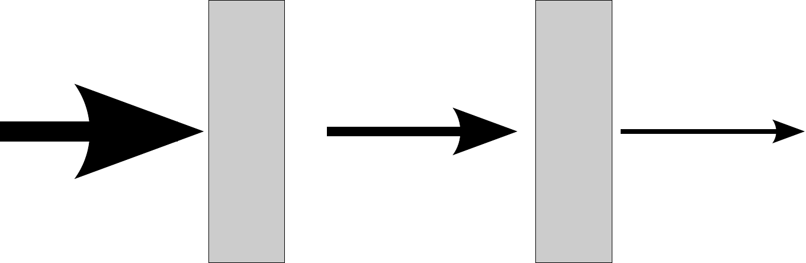
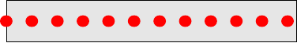

..
  SPDX-License-Identifier: BSD-3-Clause
  Copyright Contributors to the OpenEXR Project.

Theory of Deep Samples
######################

This document derives the techniques for splitting and combining two
non-solid samples of equal depth and thickness. These should should be
used by deep image "flattening" algorithms to compute the combined
colour of two samples. The formulas are defined in the document
:doc:`InterpretingDeepPixels`. This document derives those formulas,
and is for information only.

Definitions
===========

+-----------------------+--------------------------------------------------------------------------+
|       symbol          | description                                                              |
+=======================+==========================================================================+
| :math:`r`             | ratio of length of original sample to a subsample: :math:`0\le r \le 1`  |
+-----------------------+--------------------------------------------------------------------------+
| :math:`\mathbf{C_i}`  | Colour of sample :math:`i`                                               |
+-----------------------+--------------------------------------------------------------------------+
| :math:`\mathbf{C'_i}` | Colour of a subsample of :math:`i`                                       |
+-----------------------+--------------------------------------------------------------------------+
| :math:`\alpha_i`      | alpha value of sample :math:`i`                                          |
+-----------------------+--------------------------------------------------------------------------+
| :math:`\alpha'_i`     | alpha value of a subsample of :math:`i`                                  |
+-----------------------+--------------------------------------------------------------------------+
| :math:`T_i`           | transparency/transmission of sample :math:`i`; :math:`T_a=1-\alpha_a`    |
+-----------------------+--------------------------------------------------------------------------+
| :math:`\mathbf{c_i}`  | colour per unit length (‘instantaneous colour’) of :math:`i`             |
+-----------------------+--------------------------------------------------------------------------+
| :math:`t_i`           | transparency per unit length (‘instantaneous transparency’) of :math:`i` |
+-----------------------+--------------------------------------------------------------------------+

Subscripts :math:`_a` and :math:`_b` refer to the input samples;
subscript :math:`_c` refers to the combined output sample

Sample Model
============

Many deep compositing operations require subdividing a sample into two
subsamples, or else clipping a sample at a given point. When this
happens, the alpha value of the subsample(s) must be recomputed, and the
colour will also change. To derive an equation for computing the new
alpha, the amount of light attenuated by each subsample must be
considered:

   Light passing through multiple objects from left to right. Each object attenuates a fraction t of the light

In this case, light passes through two objects, from left to right. Each objects attenuates the light. Light passing through any light absorbing object will by attenuated according to the **transparency**  :math:`t` of that object. Thus, if
:math:`i` is the amount of light entering the object, the light
:math:`o` leaving the object is given by

.. math::
   o=t\cdot i
  :label: absorb

Where light passes through two objects, the light is attenuated twice (the output from the first is fed into second)

.. math::
   o=t_2\cdot(t_1\cdot i)
   :label: two

where :math:`t_2` and :math:`t_1` are the transmission of the
individual samples. In general, if the transmission :math:`t` of all
objects are the same, the light emerging from :math:`n` adjacent samples
is given by the *Beer-Lambert* law:

.. math::
   o=i\cdot t^n

.. math::
   T=\frac{o}{i}=t^n
   :label: beer

where :math:`T` is the total transmission. If :math:`t` is considered
the *transmission per unit length* and :math:`n` the length, the
equation is continuous, applying also for non-integer values of
:math:`n`\  [1]_.

An OpenEXR deep sample can then be modelled as an object of a specified
length :math:`n` which absorbs light according to equation Beer's law :eq:`beer`

Alpha vs Transparency
---------------------

OpenEXR images use alpha :math:`\alpha` instead of transparency.
:math:`T=1-\alpha`: if :math:`\alpha=1` (so :math:`T=0`) then all light
is absorbed; if :math:`\alpha=0` (so :math:`T=1`), then all light is
transmitted and the material is transparent. Substituting :math:`T` into :eq:`absorb` and :eq:`two` combined alpha of two objects is given by the *screen* compositing operation:

.. math::
   \alpha_c = 1-(1-\alpha_1)(1-\alpha_2)
   :label: screen

where :math:`\alpha_c` is the combined alpha value, and
:math:`\alpha_1` and :math:`\alpha_2` are the alpha values of the two samples.

Throughout this document, :math:`T` is preferred to :math:`\alpha` where
it gives simpler equations.

Computing :math:`t`
-------------------

OpenEXR images samples store the :math:`\alpha` of the entire sample.
This gives us the total transmission of the sample, not the
transmission per unit length :math:`t`. The total transmission :math:`T` 
and the sample length :math:`n` can be used to compute the transmission per unit length:

.. math:: t=T^\frac{1}{n}
  :label: t

Sample Properties
-----------------

The following are assumptions made by the formulas derived here:

-  Samples have **constant optical density and colour**: if a sample has
   length :math:`n` and a subsample of length :math:`n'` is extracted
   from it, the RGBA colour of the subsample will be the same regardless
   from where in the sample it is extracted. In particular, if a sample
   is split into :math:`k` subsamples of equal length, each subsample
   will have the same RGBA colour.

-  Sample attenuation is **non-scattering** and **pixel independent**:
   light travelling through the sample is either absorbed or
   transmitted; it is not reflected back down the sample or scattered
   into neighbouring samples. Scattering causes point lights to appear
   blurred when passing through fog, and also tends to make fog look
   more optically dense than it really is, since detail is lost very
   quickly, even though light is being transmitted. This effect is not
   modelled with OpenEXR volumetric samples, and must be approximated by
   including the scattered light within the volume or applied as a
   post-process. Since the light attenuation profile throughout a pixel
   will not follow the Beer-Lambert equation :eq:`beer`, extra samples
   must be used to model the pixel.

-  Sample behaviour is **unit** and **scale independent**: if a sample
   is divided into :math:`k` subsamples of equal length, then scaling
   the depth channels :math:`z_\textsf{front}` and
   :math:`z_\textsf{back}` of the deep image will not change the
   colour of the samples. When merging two deep images, prescaling the
   depth of each image by the same amount then merging the images is
   identical to merging the original images then scaling the depth of
   the result. This scaling property allows any unit to be used to store
   depth, and the unit to be changed by scaling the depth channels
   without modification of the RGBA channels.

-  Sample behaviour is **position independent**: moving a sample in
   depth will not change the RGBA values obtained by subdividing it. If
   a sample is :math:`10` units long and a subsample of :math:`2` units
   extracted from it, the subsample will have the same RGBA values
   regardless of the position in depth of the sample. Shifting two
   images by adding a constant :math:`c` to the depth channels of each
   image then merging them is identical to merging the original images
   then shifting the result.

-  Sample splitting is **non-destructive**: using the equations derived
   here, the samples of a pixel can be arbitrarily subdivided.
   Recombining the subsamples with the *over* compositing operation will
   yield the RGBA colour of the original sample (assuming sufficient
   numerical precision).

Sample Splitting
================

Alpha of a Subsample
--------------------

When a subsample of length :math:`n'` is extracted from an original
sample of length :math:`n`, the alpha value :math:`\alpha'` for
subsample must be computed.

The total transmission :math:`T'=t^{n'}`. Substituting for :math:`t`
computed for the entire sample length using :eq:`t` gives:

.. math::

   \begin{aligned}
   T'&=\left(T^\frac{1}{n}\right)^{n'} \nonumber\\
   T'&=T^\frac{n'}{n}\end{aligned}

Here, :math:`n` refers to the *length* of the original sample, but
samples are specified in OpenEXR with a front and back depth. Thus, if a
sample :math:`T` with front and back depths :math:`z_\textsf{front}`
and :math:`z_\textsf{back}` is split at point :math:`z` in space,
the transmission :math:`T'` of the front subsample is given by

.. math::

   \begin{aligned}
   T'&=T^\frac{z-z_\textrm {front}}{z_\textrm {back} - z_\textrm {front}}\\
   \alpha'&=1-\left(1-\alpha\right)^\frac{z-z_\textrm{front}}{z_\textrm {back} -
   z_\textrm{front}}\end{aligned}

Since
:math:`({z-z_\textrm{front}})/({z_\textsf{back} - z_\textsf{front}})`
is the *ratio of the original sample length to the extracted sample
length*, we can substitute this ratio for :math:`r` for the remainder.
This is equivalent to considering subdivision of a sample of unit
length.

Colour of a Subsample
---------------------

A sample with RGB information is modelled as a cylinder. The alpha
channel(s) of the sample are represented by some non-scattering,
absorbent material within it, which attenuates the light passing through
the sample. The colour channel(s) of the sample is represented by
infinitely many light sources, which emit coloured light (but don’t
absorb anything), with identical intensities :math:`\mathbf{c}`, evenly
spaced through the sample:

   Model for a sample with colour and alpha. The grey box is light
   absorbent material with transparency :math:`t`; the red dots are
   light sources each of which has colour :math:`\mathbf{c}`.

A light source at distance :math:`x` into the sample will be attenuated
by the amount of absorber between it and the front of the sample.
According to Beer-Lambert, the total transmission of that part of the
sample :math:`t` is given by

.. math::

   \begin{aligned}
   t'&=T^x\\
   \alpha'&=1-(1-\alpha)^x\end{aligned}

The light which reaches the front of the sample from the individual
light source at distance :math:`x` is :math:`\mathbf{c} T^{x}`. If there
were a finite number :math:`N` sources, the total light reaching the
front of the sample would be:

.. math:: \mathbf{C} = \sum_{k=0}^{N}\mathbf{c}{T}^{k/N}

where :math:`k/N` is the position of light :math:`k`, equal to
:math:`x`. As :math:`N` tends to infinity, this becomes

.. math::
   \begin{aligned}
   \mathbf{C} &= \int_0^1\mathbf{c}{T}^x {\mathop{}\!\textrm{d}}x\\
   &=\left.\frac{\mathbf {c}{T}^x}{\log(T)}\right|_{x=0}^{x=1} \nonumber\\
   &=\frac{\mathbf{c}(T-1)}{\log(T)}\end{aligned}
   :label: solve

The value :math:`\mathbf{C}` is the sample’s RGB value, as stored in the
OpenEXR image. Rearranging gives us the colour of each
light (or perhaps the ‘instantaneous colour’ of the sample)

.. math:: \mathbf{c} = \frac{\mathbf{C}\log(T)}{T-1}
  :label: little

If the entire sample is reduced to a subsample length :math:`r`, only a
subsection of lights are included, and we must compute the new RGB
colour :math:`\mathbf{C'}` for the subsample. Hence:

.. math::

   \begin{aligned}
   \mathbf{C'} &= \int_0^{r}\mathbf{c}{T}^x {\mathop{}\!\textrm{d}}x \\
   &=\frac{\mathbf{c}(T^{r}-1)}{\log(T)}
   \end{aligned}

Substituting for :math:`\mathbf{c}` from :eq:`little` gives

.. math::

   \begin{aligned}
   \mathbf{C'}&=\frac{\mathbf{C}\log(T)}{T-1}\frac{(T^{r}-1)}{\log(T)}   \\
   &=\mathbf{C}\frac{(T^{r}-1)}{T-1}\end{aligned}

Noting that :math:`T-1=-\alpha` and :math:`T^{r}-1=T'-1=-\alpha'` and
multiplying top and bottom by :math:`-1` gives:

.. math:: \mathbf{C'}=\mathbf{C}\frac{\alpha'}{\alpha}
  :label: splitcolour

This is exactly equivalent to **unpremultiplying** the colour by the
original alpha value, computing the new alpha value, and
**premultiplying** by the new value.

Splitting Transparent Samples
-----------------------------

When :math:`\alpha=0` (or alternatively, :math:`T=1`), unpremultiplying in :eq:`splitcolour` would require a division by zero.
A special case is derived for :math:`\alpha=0`. The sample model
of the colour provided by many light sources still applies, but there
is now no attenuation. Therefore, each light contributes equally to the
observed colour :math:`\mathbf{C}`. The ‘instantaneous’ colour equals
the final colour, (assuming sample length is normalised to 1)

.. math::
   \begin{aligned}
   \mathbf{C}&=\int_0^1 \mathbf{c} {\mathop{}\!\textrm{d}}x\\
   \mathbf{C}&=\mathbf{c}\end{aligned}
   :label: transparent

A subsection :math:`\mathbf{C'}` of length :math:`r` is given by

.. math::

   \begin{aligned}
   \mathbf{C'}&=\int_0^r \mathbf{c} {\mathop{}\!\textrm{d}}x \nonumber \\
   \mathbf{C'}&=r\mathbf{C}\end{aligned}

That is, if :math:`\alpha=0`, then scaling a sample’s length by
:math:`r` scales the colour by the same amount.

Sample Merging
==============

Now, consider combining two samples :math:`a` and :math:`b` together.
This operation is required when “tidying” a deep sample list, which is
essential before flattening a deep image into a regular one. We assume
that :math:`z_{\textsf{front}_a}=z_{\textsf{front}_b}` and
:math:`z_{\textsf{back}_a}=z_{\textsf{back}_b}` so the lengths
of each sample are the same, and they fully overlap in space. If this is
not the case, the samples should be subdivided and those subsamples
merged separately as described in the document “Interpreting OpenEXR
Deep Samples”

The same sample model using discrete light sources is used. However, at
each location, there are now two light sources, :math:`\mathbf{c_a}` and
:math:`\mathbf{c_b}`, and the light is attenuated by both :math:`t_a`
and :math:`t_b`. We can treat this as being attenuated first by
:math:`t_b`, then by :math:`t_a`, so the total light reaching the end of
the sample is:

.. math:: \mathbf{c_c}=(\mathbf{c_a}+\mathbf{c_b})(T_{a}T_b)^{x}

By substitution into :eq:`solve` and then substituting for
:math:`\mathbf{c_a}` and :math:`\mathbf{c_b}` from :eq:`little` gives

.. math::

   \begin{aligned}
   \mathbf{C_c}&=\frac{(\mathbf{c_a}+\mathbf{c_b})(T_aT_b-1)}{\log(T_aT_b)}\\
   \mathbf{C_c}&=\frac{\left(\frac{\mathbf{C_a}\log(T_a)}{T_a-1} +
   \frac{\mathbf{C_b}\log(T_b)}{T_b-1}\right)\left(T_aT_b-1\right)}{\log(T_aT_b)}\\
   \mathbf{C_c}&=\frac{\left(\frac{\mathbf{C_a}\log(1-\alpha_a)}{-\alpha_a} +
   \frac{\mathbf{C_b}\log(1-\alpha_b)}{-\alpha_b}\right)\left((1-\alpha_a)(1-\alpha_b)-1\right)}{
   \log\left((1-\alpha_a)(1-\alpha_b)\right)}\\\end{aligned}

Multiplying both parts of the top line by -1 gives

.. math::
   \mathbf{C_c}=\frac{\left(\frac{\mathbf{C_a}\log(1-\alpha_a)}{\alpha_a} +
   \frac{\mathbf{C_b}\log(1-\alpha_b)}{\alpha_b}\right)\left(1-(1-\alpha_a)(1-\alpha_b)\right)}{
   \log\left((1-\alpha_a)(1-\alpha_b)\right)}
   :label: long

Note that the combined transmission is given by :math:`T_c=T_{a}T_{b}`,
implying that the combined alpha follows the screen equation
:eq:`solve`. Substituting into both top and bottom of :eq:`long`
gives the formula for final colour:

.. math::
   \mathbf{C_c}=\frac{\left(\frac{\mathbf{C_a}\log(1-\alpha_a)}{\alpha_a} +
   \frac{\mathbf{C_b}\log(1-\alpha_b)}{\alpha_b}\right)\alpha_c}{\log(1-\alpha_c)}
   :label: combine

This is the **premultiplied** combined colour. For the unpremultiplied
colour, the :math:`\alpha_c` term can be omitted. This gives the
transmission weighted average of the unpremultiplied input colours.

Merging when One Sample is Transparent
--------------------------------------

Now suppose one of the samples (say, :math:`b`) has no alpha, so
:math:`\alpha_b=0` and :math:`T_b=1`. From :eq:`transparent`
:math:`\mathbf{c_b}=\mathbf{C_b}`. The combined colour
:math:`\mathbf{C_c}` is attenuated according to :math:`T_a`, the
transmission of :math:`a` alone, and the combined colour is given by:

.. math:: \mathbf{c_c} = (\mathbf{c_a}+\mathbf{C_b})(T_a)^{x}

and substituting into :eq:`solve` gives:

.. math::

   \begin{aligned}
   \mathbf{C_c}&= \frac{(\mathbf{c_a}+\mathbf{C_b})(T_a-1)}{\log(T_a)}\nonumber\\
   &=\frac{\left(\frac{\mathbf{C_a}\log(1-\alpha_a)}{-\alpha_a} +
   \mathbf{C_b}\right)\left((1-\alpha_a)-1\right)}{\log(1-\alpha_a)} \nonumber\\
   \mathbf{C_c}&=\frac{\left(\frac{\mathbf{C_a}\log(1-\alpha_a)}{\alpha_a} -
   \mathbf{C_b}\right)\alpha_a}{\log(1-\alpha_a)}\end{aligned}

Merging Two Transparent Samples
-------------------------------

Where both samples are transparent, the colours simply add together:

.. math:: \mathbf{C_c}=\mathbf{C_a}+\mathbf{C_b}

Merging Solid Samples
---------------------

For numerical stability, we must give a sensible value for
:math:`\mathbf{C_c}` when :math:`\alpha_b=1`. Equation :eq:`combine`
is undefined, since :math:`\log(1-\alpha_b)=\log(0)=-\infty`. We follow
the initial model of light sources in an absorbing material, but now the
absorbing material absorbs all light. Thus, we must be observing only
its closest light source (that at :math:`x=0`) in the solid sample: the
sample will absorb light from its other sources. Thus, we can treat
:math:`b` as an infinitely thin ‘discrete’ sample at the front of the
sample, which will block all light behind it; we can simply composite
:math:`b` over :math:`a`. Therefore, if :math:`\alpha_b=1` and
:math:`\alpha_a<1`, the total observed colour will be
:math:`\mathbf{C_b}`. Transposing :math:`a` and :math:`b` gives
:math:`\mathbf{C_c}=\mathbf{C_a}` if :math:`\alpha_a=1`

Following the definitions above, when :math:`\alpha_a=1` and
:math:`\alpha_b=1`, then :math:`\mathbf{C_c}=\mathbf{C_a}+\mathbf{C_b}`.
However, for stability, it makes sense to define

.. math:: \mathbf{C_c}=\frac{\mathbf{C_a}+\mathbf{C_b}}{2}

This approach gives more stable results when there is random sampling
error in the depth channel. Assume that the front depth of sample
:math:`A` differs by some small amount from that of :math:`B`, so that
:math:`z_a=\delta+z_b`. Only the front sample will be visible: if
:math:`\delta<0`, then :math:`\mathbf{C_c}=\mathbf{C_a}`; if
:math:`\delta>0`, then :math:`\mathbf{C_c}=\mathbf{C_b}`. Setting
:math:`\mathbf{C_c}=\mathbf{C_a}+\mathbf{C_b}` when :math:`\delta=0`
gives an image which is (potentially) twice as bright. If :math:`\delta`
is random noise due to sampling, we will get a random pattern of bright
pixels whenever :math:`\delta=0`. Using the mean colour seems a safer
option. However, this is *not* associative: when combining three solid
samples :math:`d`,\ :math:`e` and :math:`f` does not give the same
result as combining first :math:`d` and :math:`e`, then combining the
result with :math:`f`.

Summary
=======

To **clip a sample** covering range :math:`z_\textsf{front}` —
:math:`z_\textsf{back}` into a subsample
:math:`z_\textsf{front}` — :math:`z`, or **extract a subsample** of
length :math:`l'` from a sample of length :math:`l`:

.. math::

   \begin{aligned}
   r&=\frac{z-z_\textsf{front}}{z_\textsf{back}-z_\textsf{front}} = \frac{l'}{l}\\
   \alpha' &= 1-(1-\alpha)^r\\
   \mathbf{C'} &=
   \begin{cases}
   r\mathbf{C},& \text{ if } \alpha=0\\
   \mathbf{C}\frac{\alpha'}{\alpha},& \text{ otherwise}
   \end{cases}\end{aligned}

where :math:`\alpha` and :math:`\alpha'` are the alpha values of the
original sample and the subsample respectively, and :math:`\mathbf{C}`
and :math:`\mathbf{C'}` are the colours of the original sample and the
subsample respectively

To **merge two samples** :math:`a` and :math:`b` into a combined sample
:math:`c`:

.. math::

   \begin{aligned}
   \alpha_c &= 1-(1-\alpha_a)(1-\alpha_b)\\
   \mathbf{C_c} &=
   \begin{cases}
   \mathbf{C_a} + \mathbf{C_b}, & \text{if } \alpha_a=0 \text { and } \alpha_b=0\\
   \mathbf{C_a},& \text{if } \alpha_a=1 \text{ and } \alpha_b <1 \\
   \mathbf{C_b},& \text{if } \alpha_b=1 \text{ and } \alpha_a <1 \\
   (\mathbf{C_a} + \mathbf{C_b})/2, & \text{if } \alpha_a=1 \text { and } \alpha=1\\
   \alpha_a\left(\frac{\mathbf{C_a}\log(1-\alpha_a)}{\alpha_a} - \mathbf{C_b}\right)/\log(1-\alpha_a),&
   \text {if } 0<\alpha_a<1 \text { and } \alpha_b=0 \\
   \alpha_b\left(\frac{\mathbf{C_b}\log(1-\alpha_b)}{\alpha_b} - \mathbf{C_a}\right)/\log(1-\alpha_b),&
   \text {if } 0<\alpha_b<1 \text { and } \alpha_a=0 \\
   \alpha_c\left(\frac{\mathbf{C_a}\log(1-\alpha_a)}{\alpha_a} +
   \frac{\mathbf{C_b}\log(1-\alpha_b)}{\alpha_b}\right)/\log(1-\alpha_c),& \text{otherwise}
   \end{cases}\end{aligned}

.. [1]
   Various forms of the Beer-Lambert law exist, using different
   constants. For example, :math:`o=i\cdot10^{-\epsilon l c}`, where
   :math:`\epsilon` and :math:`c` are the molar absorptivity and
   concentration respectively. This is equivalent to :eq:`beer` if
   :math:`t=10^{-\epsilon c}` and :math:`l=n`
